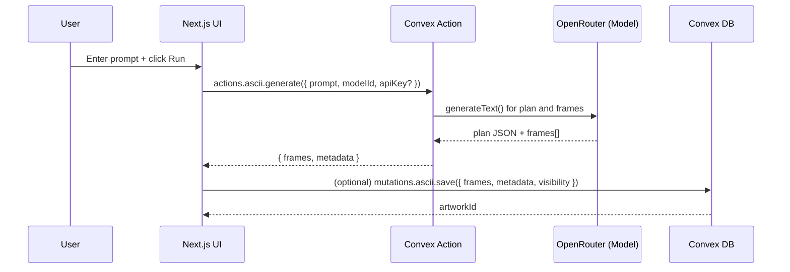
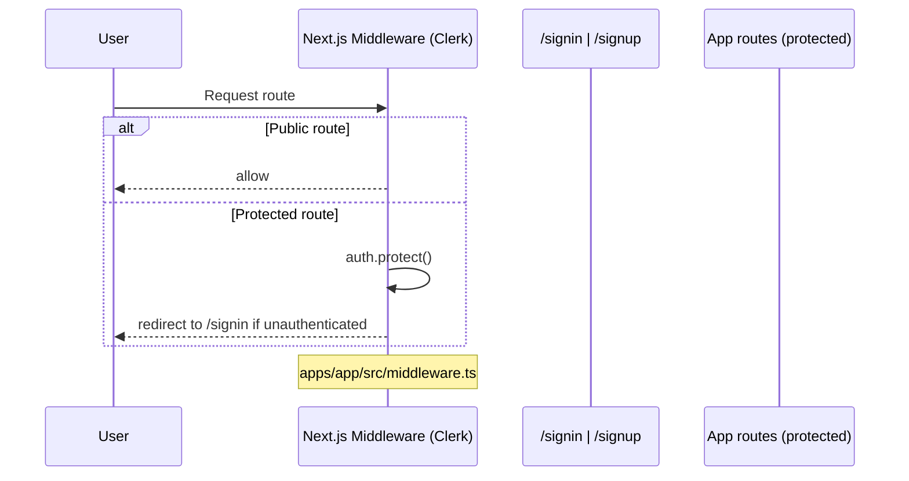
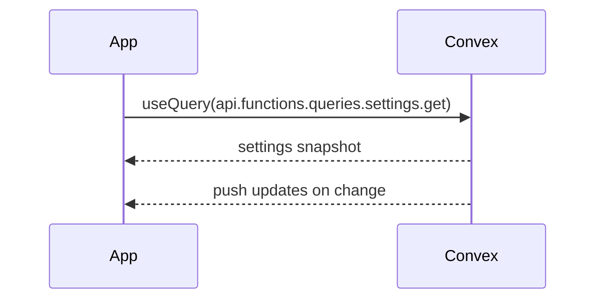

# ASCII XYZ – Architecture and Technical Documentation

This document maps the full system architecture for the ascii-xyz Turborepo and links to deep‑dive documentation in the `docs/` directory.

The platform is a Next.js 15 app that generates and shares ASCII animations with an AI backend powered by Convex and Clerk authentication. UI is composed with a lightweight design system modeled after Linear.

## Table of contents

1. Monorepo overview
2. High‑level architecture (Mermaid)
3. Data flows (UI → Convex → storage; auth; real‑time)
4. Component and module relationships
5. API and backend service map (Convex)
6. State management patterns (Jotai + Convex React)
7. Environment variables and configuration
8. Database/schema summary (Convex)
9. ASCII art generation pipeline and data formats
10. Bring Your Own Key (BYOK) AI support
11. Linear‑inspired design system usage
12. App routes inventory (apps/app/src/app)
13. Navigation to additional docs

---

## 1) Monorepo overview

- apps/app (package: `ascii-app`)
  - Next.js 15 app (React 19, Tailwind v4). Pages live under `apps/app/src/app` with route groups for authenticated/unauthenticated layouts.
  - Consumes Clerk for auth, Convex for data/real‑time, PostHog for analytics.
- packages/backend (`@repo/backend`)
  - Convex project (`packages/backend/convex`): schema, queries, mutations, actions, http router (Clerk webhook).
- packages/auth (`@repo/auth`)
  - Thin wrappers around Clerk (client, server, provider) and an optional billing façade.
- packages/design (`@repo/design`)
  - UI component library (shadcn/ui base + Linear‑inspired motion). Also ships design utilities, providers, and styles.
- packages/ascii (`@repo/ascii`)
  - Reusable ASCII engine, generators, hooks, and presets. The app also has an embedded copy at `apps/app/src/lib/ascii` for direct usage.

Build tooling: TypeScript 5.9, Turborepo, Biome/Ultracite for lint/format, Vitest in select packages.

---

## 2) High‑level architecture

```mermaid
flowchart LR
  subgraph Client[Browser]
    UI[Next.js 15 App\nReact 19 + Tailwind v4]\n
    Design[@repo/design\ncomponents + styles]
    AsciiUI[@repo/ascii\nengine/hooks/presets]
  end

  subgraph Edge
    Next[Next.js Routing\napp router + middleware]
  end

  subgraph Services
    Convex[(Convex Backend)]
    Clerk[(Clerk Auth)]
    PostHog[(PostHog Analytics)]
    OpenRouter[(OpenRouter AI Models)]
  end

  UI --> Next
  Next -- useQuery/useMutation, actions --> Convex
  Next -- ClerkProvider --> Clerk
  Next -- rewrites /ingest* --> PostHog
  Convex -- actions.ascii.generate --> OpenRouter
  Convex -- http /clerk-users-webhook --> Clerk
  Convex <---> ConvexDB[(Convex Storage)]
  Convex -. subscriptions .- Next
```

Key points
- All server state is handled by Convex. The app subscribes to live queries via `convex/react` hooks for real‑time updates.
- Auth is fully handled by Clerk (middleware protects non‑public routes; webhooks sync users into Convex tables).
- AI ASCII generation uses Convex actions that call OpenRouter models; BYOK allows users to supply their own API key.

---

## 3) Data flows

### 3.1 ASCII generation (client → Convex action → AI → Convex mutation)



Notes
- The UI calls the Convex action via `convex/nextjs` `fetchAction`. The action can accept a user‑provided API key (BYOK) or use `OPENROUTER_API_KEY`.
- Frame format is a JSON array of strings (each string is a multi‑line frame). See section 9.

### 3.2 Auth sign‑in / gate



### 3.3 Real‑time reads

Convex queries return live values; clients subscribe and re‑render on change.



---

## 4) Component and module relationships

System‑level relationships and boundaries:

```mermaid
graph TD
  A[apps/app UI] -->|consumes| D[@repo/design components]
  A -->|uses| J[Jotai atoms (ui + models)]
  A -->|convex/react| Q[Convex queries/mutations]
  A -->|uses| AE[@repo/ascii engine/hooks]
  A -->|uses local| ALE[apps/app/src/lib/ascii/*]
  Q --> S[(Convex schema tables)]
  A -->|auth context| CL[Clerk Provider]
```

Highlights
- Design components are strictly presentational; business logic stays in app hooks and Convex functions.
- Jotai atoms model UI and model selection state. Convex handles server state with live queries.
- The app currently uses a local copy of the ASCII engine under `apps/app/src/lib/ascii` and can also consume `@repo/ascii` where desired.

---

## 5) API and backend service map (Convex)

All Convex code lives under `packages/backend/convex`.

- Schema: `schema.ts`
- Auth helpers: `lib/auth.ts`
- ASCII helpers: `lib/ascii.ts`
- AI model selection: `lib/ai.ts`
- HTTP router (Clerk webhooks): `http.ts` (route `/clerk-users-webhook`)

Functions grouped by domain

- functions/actions/ascii.ts
  - generate(args: { prompt, apiKey?, userId?, modelId? }) → { frames: string[]; metadata: {...} }
  - generateVariation(args: { originalFrames, variationPrompt, apiKey?, userId?, modelId? }) → { frames, metadata }
  - enhance(args: { frames, enhancementType, apiKey? }) → { frames, enhancementType }
- functions/mutations/ascii.ts
  - save({ userId, prompt, frames, metadata, visibility? }) → artworkId
  - updateVisibility({ id, visibility }) → { success: true }
  - remove({ id, userId }) → { success: true }
  - incrementViews({ id }) → void
  - toggleLike({ id, userId, liked }) → void
- functions/queries/ascii.ts
  - list({ userId?, visibility?, limit? }) → Doc<'artworks'>[]
  - get({ id, userId? }) → Doc<'artworks'> | null (permission‑checked)
  - getPublic({ limit?, cursor? }) → Doc<'artworks'>[]
  - search({ query, userId?, limit? }) → Doc<'artworks'>[]
  - getTrending({ limit?, timeframe? }) → Doc<'artworks'>[]
- functions/queries/collections.ts (contains both queries and mutations)
  - list(), get({ id })
  - create({ name, description?, visibility? }) → id
  - addArtwork({ collectionId, artworkId }), removeArtwork({ ... })
  - update({ id, name?, description?, visibility? }), remove({ id })
- functions/queries/files.ts
  - getUrl({ storageId }), getFile({ fileId }), listUserFiles({ artworkId? })
- functions/queries/shares.ts (mix of queries + mutations)
  - create({ artworkId, expiresIn?, maxViews? }) → { shareId, shareCode }
  - getByCode({ shareCode }) → artwork | null
  - list() → share[] (for current user)
  - revoke({ shareId })
- functions/queries/users.ts
  - current(), get({ userId })
  - helpers: getCurrentUser(ctx), getCurrentUserOrThrow(ctx)
- functions/mutations/files.ts
  - generateUploadUrl(), createFileRecord({ storageId, filename, mimeType, size, artworkId? }) → fileId
  - deleteFile({ fileId })
- functions/mutations/settings.ts
  - update({ theme?, defaultVisibility?, emailNotifications?, preferredModel?, preferredProvider? })
  - addApiKey({ name, key, provider }), removeApiKey({ name })
- functions/internal/users.ts
  - upsertFromClerk({ data }), deleteFromClerk({ clerkUserId })

HTTP endpoints
- Convex `http.ts`: `POST /clerk-users-webhook` (Clerk webhook, Svix signature verified via `CLERK_WEBHOOK_SECRET`).
- Next.js rewrites (from `@repo/next-config`) proxy PostHog under `/ingest/*`.

---

## 6) State management patterns

UI/Client state
- Jotai atoms under `apps/app/src/atoms`:
  - `mobileUserMenuOpenAtom: atom<boolean>` — mobile user menu visibility.
  - Model selection/enablement (`models.ts`):
    - `enabledModelsByProviderAtom: atomWithStorage<{ openrouter: string[] }>`
    - `selectedModelIdAtom: atomWithStorage<string>`
    - `availableModelsAtom: atom<AIModel[]>` (static defaults)
    - Derived and action atoms: `isModelEnabledAtom`, `toggleModelAtom`, `enabledModelsAtom`, `selectedModelAtom`.

Server data
- The app uses Convex React hooks for real‑time server state (not SWR):
  - `useQuery(api.functions.queries.settings.get)` → user settings
  - `useMutation(api.functions.mutations.settings.update | addApiKey | removeApiKey)`
  - Shares hooks (`apps/app/src/hooks/use-shares.ts`): create/list/revoke via Convex.

Cache/real‑time characteristics
- Convex queries are live: subscribed components re‑render on backend changes.
- Prefer small, focused queries per view; mutations are optimistic when appropriate at the app layer.

---

## 7) Environment variables and configuration

Primary variables (see `.env.example` for full list):

- App (Next.js)
  - `NEXT_PUBLIC_APP_URL` — base URL for the app.
  - Clerk: `NEXT_PUBLIC_CLERK_PUBLISHABLE_KEY`, `CLERK_SECRET_KEY`, `CLERK_WEBHOOK_SECRET`.
  - Convex: `NEXT_PUBLIC_CONVEX_URL` (set by Convex/Vercel integration).
  - Analytics (optional): `NEXT_PUBLIC_POSTHOG_KEY`, `NEXT_PUBLIC_POSTHOG_HOST`.
- Backend (Convex)
  - OpenRouter: `OPENROUTER_API_KEY` (server default if user doesn’t BYOK).
- Optional services
  - Email: `RESEND_API_KEY`.
  - Storage (R2): `R2_ACCOUNT_ID`, `R2_ACCESS_KEY_ID`, `R2_SECRET_ACCESS_KEY`, `R2_BUCKET_NAME`.

Next.js config
- `@repo/next-config/index.ts` defines PostHog rewrites (`/ingest/*`) and sets `skipTrailingSlashRedirect`.

---

## 8) Database/schema summary (Convex)

Defined in `packages/backend/convex/schema.ts`.

- `users`: Clerk‑synced users (indexed by `clerkId`, `email`).
- `artworks`: userId (string, Clerk id), `prompt`, `frames: string[]`, `metadata { width, height, fps, generator, model, style?, createdAt }`, `visibility`, `featured?`, `likes?`, `views?`, timestamps. Indexes by user, visibility, created, featured; search index on `prompt`.
- `artworkEmbeddings`: `artworkId`, `embedding: float64[]`, `model`, `createdAt`; vector index.
- `collections`: `userId: Id<'users'>`, `name`, `description?`, `artworkIds: Id<'artworks'>[]`, `visibility`, timestamps.
- `shares`: `artworkId`, `shareCode`, `expiresAt?`, `maxViews?`, `viewCount`, `createdAt`; indexes on shareCode, artwork.
- `userSettings`: per‑user theme, defaultVisibility, emailNotifications, preferences, optional `apiKeys: { name, key, provider, createdAt }[]`.
- `generations`: prompt runs for analytics/diagnostics.
- `files`: Convex storage linkage (`storageId`), file metadata, optional `artworkId` join.

Relationships
- `artworks.userId` is a string (Clerk id) rather than a foreign key to `users`.
- Collections embed an array of `artworkIds`.

---

## 9) ASCII generation pipeline and data formats

Client components
- `AsciiEngine` renders frames at a given FPS and supports `loop`, `reverse`, `pingPong`, `autoPlay`, `visibilityOptimized`, and event callbacks. Rendering uses a monospace font with `white-space: pre`.

Backend actions
- `actions.ascii.generate`:
  1) Builds a “generation plan” via AI (`generateText`) describing dimensions, fps, characters, and style.
  2) Requests the frames array from the model following the plan.
  3) Returns `{ frames: string[]; metadata: { prompt, width, height, fps, frameCount, model, ... } }`.

Storage formats
- Animation frames: JSON array of strings; each string is a single frame with `\n` newlines.
- Example

```json
[
  "line1\nline2\n…",
  "line1\nline2\n…"
]
```

Validation
- `lib/ascii.validateFrames(frames: string[]): boolean` checks that a non‑empty string array is provided. The action also normalizes frame dimensions to the planned width/height.

---

## 10) BYOK (Bring Your Own Key) AI support

Where it shows up
- Settings UI: `apps/app/src/app/(authenticated)/(settings)/settings/models/page.tsx` lets users add API keys (`userSettings.apiKeys[]`) and select/enable models.
- Convex mutations: `mutations.settings.addApiKey/removeApiKey` persist keys; `mutations.settings.update` stores preferences.
- Generation action: `actions.ascii.generate` accepts an `apiKey` and `modelId`. If `apiKey` is omitted, the backend uses `OPENROUTER_API_KEY`.

UI atoms relevant to BYOK
- `selectedModelIdAtom`, `enabledModelsByProviderAtom`, derived `selectedModelAtom` and `enabledModelsAtom` drive model selection.

---

## 11) Linear‑inspired design system usage

- Package: `@repo/design`
  - Components are exported from `packages/design/components/ui/*` through `components/index.ts`.
  - Motion policy (Linear‑style): 0ms in / 150ms out for general UI; 0/0 for menu‑like portals. See `packages/design/styles/transitions.css` and `docs/linear-ux.md`.
  - Utilities: `cn`, `capitalize`, `handleError`, `srOnly` in `packages/design/lib/utils.ts`.
  - Provider: `packages/design/providers/theme.tsx` sets theme and updates mobile chrome color.

Consumption patterns
- Import UI as `@repo/design/components/ui/*` and utilities from `@repo/design/lib/*`.
- Keep business logic in app hooks; components are presentational with accessible defaults and Tailwind tokens.

---

## 12) App routes inventory (apps/app/src/app)

Route groups and pages discovered on 2025‑09‑05:

- Root level
  - `/` → generation UI (Create as home) at `(authenticated)/page.tsx`. Global error boundaries: `error.tsx`, `global-error.tsx`, `not-found.tsx`. App icon/manifest: `icon.tsx`, `manifest.ts`.
  - `/share/[token]` → publicly accessible shared artwork page.
  - Middleware: `apps/app/src/middleware.ts` enforces auth; public routes include `/`, `/signin`, `/signup`, `/share/*`, assets.

- Group: `(unauthenticated)`
  - `/signin` → sign‑in page.
  - `/signup` → sign‑up page.

- Group: `(authenticated)`
  - Layout: `client-layout.tsx`, group `layout.tsx`.
  - `/` (home) → ASCII creation UI (`(authenticated)/page.tsx` uses `create/actions.ts`).
  - Sub‑group `(main)`
    - `/art/[id]` → artwork detail page.
  - Sub‑group `(settings)`
    - `/settings` → redirected to `/settings/models` by middleware.
    - `/settings/models` → model selection and BYOK management UI.

If new pages are added under `apps/app/src/app`, update this section and the `docs/user-flows/*` diagrams accordingly.

---

## 13) Navigation to additional docs

- User flows (Mermaid): `docs/user-flows/`
- Component library docs: `docs/components/`
- API/backend docs: `docs/api/`
- Onboarding and environment setup: `docs/ONBOARDING.md`, `docs/ENVIRONMENT.md`
