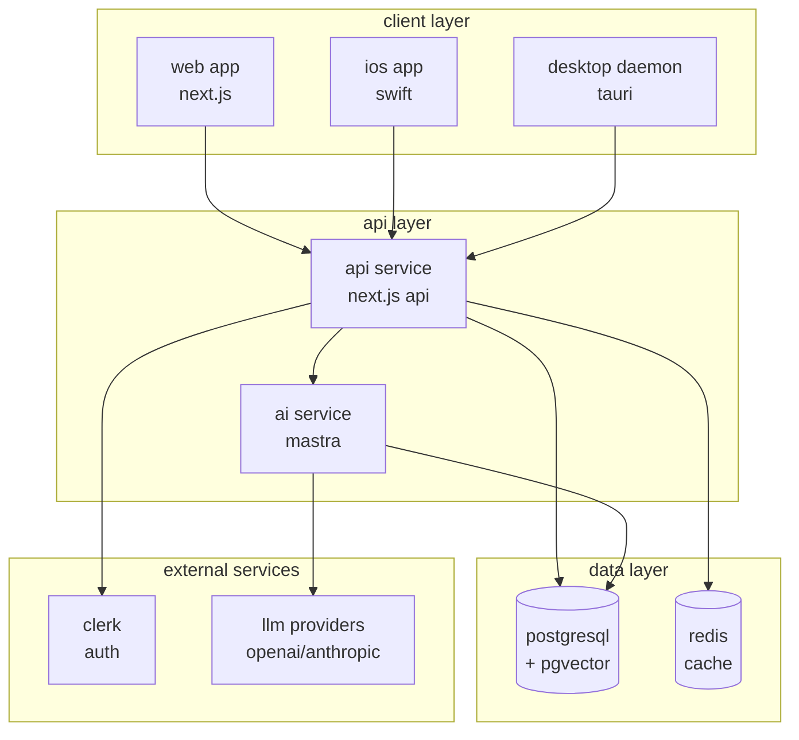
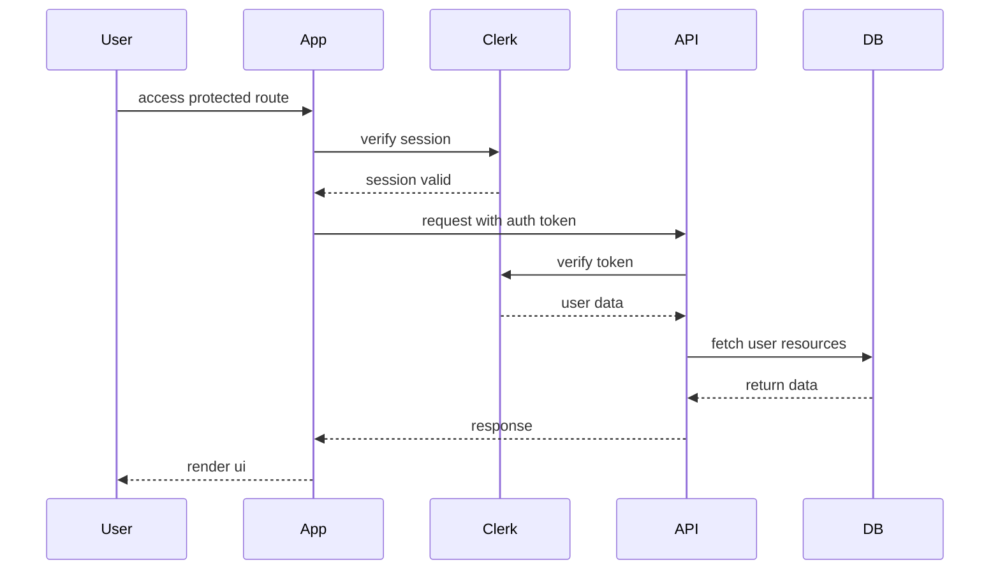

# architecture

arbor follows a modular, microservices-inspired architecture built as a turborepo monorepo.

## system overview



## monorepo structure

```
arbor-xyz/
├── apps/                 # applications
│   ├── app/             # main web application
│   ├── api/             # api service
│   ├── ai/              # ai service
│   └── daemon/          # desktop daemon
├── packages/            # shared packages
│   ├── @repo/api/       # domain services
│   ├── @repo/database/  # database schema
│   ├── @repo/design/    # ui components
│   ├── @repo/auth/      # authentication
│   ├── @repo/mastra/    # ai client
│   ├── @repo/cache/     # caching layer
│   └── @repo/orpc/      # rpc framework
└── turbo.json          # turborepo config
```

## core components

### web application (`apps/app`)

next.js 15 application with app router:

<CodeGroup>
```typescript layout.tsx
export default function RootLayout({
  children,
}: {
  children: React.ReactNode
}) {
  return (
    <ClerkProvider>
      <SWRProvider>
        <ThemeProvider>
          {children}
        </ThemeProvider>
      </SWRProvider>
    </ClerkProvider>
  )
}
```

```typescript middleware.ts
export default clerkMiddleware({
  publicRoutes: ['/sign-in', '/sign-up'],
  afterAuth(auth, req) {
    if (!auth.userId && !isPublicRoute(req)) {
      return redirectToSignIn({ returnBackUrl: req.url })
    }
  },
})
```
</CodeGroup>

key features:
- server components for optimal performance
- streaming ui with suspense boundaries
- optimistic updates with swr
- view transitions for smooth navigation

### api service (`apps/api`)

next.js api routes with orpc:

```typescript
// packages/orpc/router.ts
export const router = createRouter()
  .use(authMiddleware)
  .use(rateLimitMiddleware)
  .router({
    chat: chatRouter,
    user: userRouter,
    project: projectRouter,
    workspace: workspaceRouter,
    settings: settingsRouter,
  })
```

features:
- type-safe rpc with orpc
- automatic openapi generation
- rate limiting per endpoint
- comprehensive error handling

### ai service (`apps/ai`)

mastra-powered ai orchestration:

```typescript
// apps/ai/src/mastra/index.ts
export const mastra = new Mastra({
  agents: {
    chat: chatAgent,
    code: codeAgent,
    summarizer: summarizerAgent,
  },
  tools: {
    ...mcpTools,
    ...customTools,
  },
  memory: {
    provider: 'pgvector',
    config: { connectionString: DATABASE_URL },
  },
})
```

capabilities:
- multi-agent system
- semantic memory with pgvector
- mcp tool integration
- streaming responses

## data architecture

### database schema

postgresql with drizzle orm:

```typescript
// packages/database/schema.ts
export const users = pgTable('users', {
  id: uuid('id').primaryKey().defaultRandom(),
  clerkId: text('clerk_id').notNull().unique(),
  email: text('email').notNull(),
  createdAt: timestamp('created_at').defaultNow(),
})

export const chats = pgTable('chats', {
  id: uuid('id').primaryKey().defaultRandom(),
  userId: uuid('user_id').references(() => users.id),
  threadId: text('thread_id').unique(),
  title: text('title'),
  model: text('model'),
  createdAt: timestamp('created_at').defaultNow(),
})
```

### caching strategy

multi-layer caching:

1. **client cache** - swr with deduping
2. **api cache** - redis for hot data
3. **database cache** - query result caching

```typescript
// packages/cache/index.ts
export const cache = {
  async get<T>(key: string): Promise<T | null> {
    const cached = await redis.get(key)
    return cached ? JSON.parse(cached) : null
  },
  
  async set(key: string, value: any, ttl = 3600) {
    await redis.setex(key, ttl, JSON.stringify(value))
  },
}
```

## security architecture

### authentication flow



### security layers

1. **authentication** - clerk with jwt
2. **authorization** - rbac with middleware
3. **rate limiting** - per-user and per-ip
4. **input validation** - zod schemas
5. **sql injection** - prisma/drizzle orm
6. **xss protection** - react sanitization
7. **csrf protection** - token validation

## deployment architecture

### production stack

<Tabs>
  <Tab title="web">
    **vercel**
    - edge functions
    - automatic scaling
    - global cdn
    - preview deployments
  </Tab>
  
  <Tab title="database">
    **neon**
    - serverless postgres
    - autoscaling
    - branching
    - pgvector support
  </Tab>
  
  <Tab title="ai">
    **mastra cloud**
    - managed ai service
    - automatic scaling
    - monitoring
    - tool registry
  </Tab>
  
  <Tab title="cache">
    **upstash redis**
    - serverless redis
    - global replication
    - edge caching
  </Tab>
</Tabs>

### infrastructure as code

```yaml
# .github/workflows/deploy.yml
name: deploy
on:
  push:
    branches: [main]
    
jobs:
  deploy:
    runs-on: ubuntu-latest
    steps:
      - uses: actions/checkout@v4
      - uses: pnpm/action-setup@v3
      - run: pnpm install
      - run: pnpm build
      - run: pnpm deploy
```

## performance optimization

### frontend optimization

- **code splitting** - dynamic imports
- **image optimization** - next/image
- **font optimization** - next/font
- **prefetching** - link prefetch
- **streaming ssr** - react suspense

### backend optimization

- **connection pooling** - database connections
- **query optimization** - indexed queries
- **batch processing** - dataloader pattern
- **async operations** - promise.all
- **caching** - multi-layer strategy

### ai optimization

- **streaming responses** - server-sent events
- **token optimization** - prompt engineering
- **model selection** - cost/performance balance
- **semantic caching** - similar query detection
- **batch embeddings** - vector operations

## monitoring & observability

### logging

```typescript
// structured logging with context
logger.info('api request', {
  userId: auth.userId,
  endpoint: req.url,
  method: req.method,
  duration: Date.now() - start,
})
```

### metrics

- **response time** - p50, p95, p99
- **error rate** - 4xx, 5xx
- **throughput** - requests/second
- **saturation** - cpu, memory
- **business metrics** - chats, tasks

### tracing

distributed tracing with opentelemetry:

```typescript
const span = tracer.startSpan('chat.create')
try {
  const result = await createChat(data)
  span.setStatus({ code: SpanStatusCode.OK })
  return result
} catch (error) {
  span.recordException(error)
  throw error
} finally {
  span.end()
}
```

## scalability considerations

### horizontal scaling

- **stateless services** - no server state
- **database pooling** - connection management
- **queue processing** - background jobs
- **cdn distribution** - static assets

### vertical scaling

- **database indexes** - query performance
- **memory optimization** - garbage collection
- **cpu optimization** - algorithm efficiency
- **network optimization** - compression

## design principles

1. **separation of concerns** - clear boundaries
2. **single responsibility** - focused modules
3. **dependency injection** - testability
4. **interface segregation** - minimal apis
5. **open/closed principle** - extensibility

## next steps

<CardGroup cols={2}>
  <Card title="api reference" icon="code" href="/reference/api">
    explore api documentation
  </Card>
  
  <Card title="deployment guide" icon="rocket" href="/guides/deployment">
    deploy to production
  </Card>
  
  <Card title="development setup" icon="wrench" href="/guides/development-setup">
    set up development environment
  </Card>
  
  <Card title="testing strategy" icon="vial" href="/guides/testing-strategy">
    understand testing approach
  </Card>
</CardGroup>