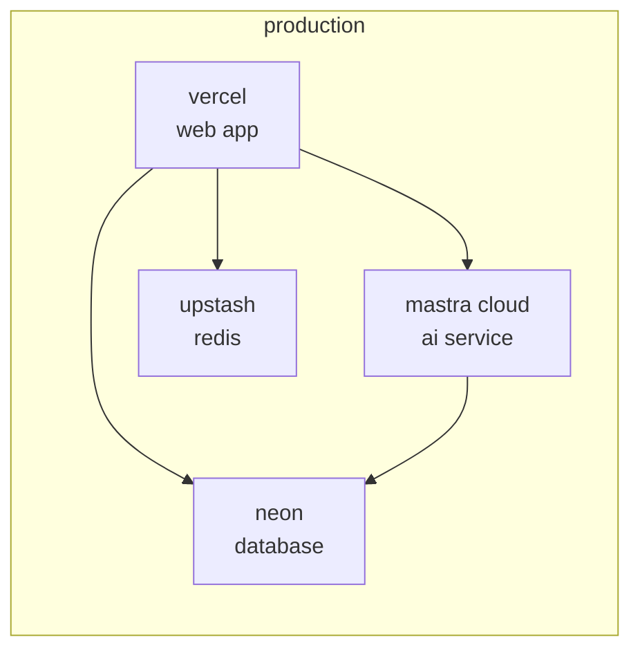

# deployment

deploy arbor to production using vercel and mastra cloud.

## architecture overview



## deployment platforms

<Tabs>
  <Tab title="vercel">
    **web application** (`apps/app`)
    - automatic deployments from github
    - edge functions for api routes
    - global cdn distribution
    - preview deployments for prs
  </Tab>
  
  <Tab title="mastra cloud">
    **ai service** (`apps/ai`)
    - managed ai infrastructure
    - automatic scaling
    - agent orchestration
    - tool registry
  </Tab>
  
  <Tab title="neon">
    **postgresql database**
    - serverless postgres
    - autoscaling
    - branching for previews
    - pgvector support
  </Tab>
  
  <Tab title="upstash">
    **redis cache** (optional)
    - serverless redis
    - edge caching
    - global replication
    - rate limiting
  </Tab>
</Tabs>

## deployment steps

### vercel deployment

<Steps>
  <Step title="connect github repository">
    1. go to [vercel dashboard](https://vercel.com)
    2. click "add new project"
    3. import github repository
    4. select `arbor-xyz` repository
  </Step>
  
  <Step title="configure build settings">
    ```json
    {
      "framework": "nextjs",
      "rootDirectory": "apps/app",
      "buildCommand": "cd ../.. && pnpm build --filter=arbor-app",
      "outputDirectory": "apps/app/.next",
      "installCommand": "pnpm install"
    }
    ```
  </Step>
  
  <Step title="set environment variables">
    add in vercel dashboard:
    
    ```env
    # required
    NEXT_PUBLIC_AI_URL=https://your-project.mastra.cloud
    NEXT_PUBLIC_APP_URL=https://your-app.vercel.app
    
    # clerk authentication
    NEXT_PUBLIC_CLERK_PUBLISHABLE_KEY=pk_live_...
    CLERK_SECRET_KEY=sk_live_...
    
    # database
    DATABASE_URL=postgresql://...
    
    # optional ai keys (user configurable)
    OPENROUTER_API_KEY=sk-or-...
    OPENAI_API_KEY=sk-...
    ANTHROPIC_API_KEY=sk-ant-...
    ```
  </Step>
  
  <Step title="deploy">
    click "deploy" and wait for build to complete
  </Step>
</Steps>

### mastra cloud deployment

<Steps>
  <Step title="install mastra cli">
    ```bash
    npm install -g @mastra/cli
    ```
  </Step>
  
  <Step title="authenticate">
    ```bash
    mastra login
    ```
  </Step>
  
  <Step title="initialize project">
    ```bash
    cd apps/ai
    mastra init
    ```
  </Step>
  
  <Step title="configure deployment">
    create `mastra.config.ts`:
    
    ```typescript
    export default {
      name: 'arbor-ai',
      agents: ['chat', 'code', 'summarizer'],
      tools: ['mcp/*'],
      memory: {
        provider: 'pgvector',
        config: {
          connectionString: process.env.DATABASE_URL
        }
      }
    }
    ```
  </Step>
  
  <Step title="deploy to cloud">
    ```bash
    mastra deploy
    ```
    
    your ai service will be available at:
    `https://[project-name].mastra.cloud`
  </Step>
</Steps>

### database setup

<Steps>
  <Step title="create neon project">
    1. sign up at [neon.tech](https://neon.tech)
    2. create new project
    3. copy connection string
  </Step>
  
  <Step title="run migrations">
    ```bash
    # set database url
    export DATABASE_URL="postgresql://..."
    
    # run migrations
    pnpm db:migrate:deploy
    ```
  </Step>
  
  <Step title="enable pgvector">
    ```sql
    CREATE EXTENSION IF NOT EXISTS vector;
    ```
  </Step>
</Steps>

## environment variables

### production variables

<CodeGroup>
```env apps/app/.env.production
# public urls
NEXT_PUBLIC_AI_URL=https://arbor-ai.mastra.cloud
NEXT_PUBLIC_APP_URL=https://arbor.app

# authentication
NEXT_PUBLIC_CLERK_PUBLISHABLE_KEY=pk_live_...
CLERK_SECRET_KEY=sk_live_...

# database
DATABASE_URL=postgresql://...

# optional
SENTRY_DSN=https://...
POSTHOG_KEY=phc_...
```

```env apps/ai/.env.production
# database (same as app)
DATABASE_URL=postgresql://...

# ai providers
OPENAI_API_KEY=sk-...
ANTHROPIC_API_KEY=sk-ant-...
OPENROUTER_API_KEY=sk-or-...

# main app
MAIN_APP_URL=https://arbor.app
```
</CodeGroup>

## ci/cd pipeline

### github actions

```yaml
# .github/workflows/deploy.yml
name: deploy

on:
  push:
    branches: [main]
  pull_request:
    branches: [main]

jobs:
  test:
    runs-on: ubuntu-latest
    steps:
      - uses: actions/checkout@v4
      - uses: pnpm/action-setup@v3
      - uses: actions/setup-node@v4
        with:
          node-version: 20
          cache: 'pnpm'
      
      - run: pnpm install
      - run: pnpm lint
      - run: pnpm typecheck
      - run: pnpm test
      - run: pnpm build

  deploy:
    needs: test
    if: github.ref == 'refs/heads/main'
    runs-on: ubuntu-latest
    steps:
      - uses: actions/checkout@v4
      - run: echo "deployed via vercel and mastra webhooks"
```

## monitoring

### application monitoring

<Tabs>
  <Tab title="vercel analytics">
    monitor web app performance:
    - page views
    - web vitals
    - function execution
    - error tracking
  </Tab>
  
  <Tab title="mastra dashboard">
    monitor ai service:
    - agent usage
    - tool calls
    - memory operations
    - error logs
  </Tab>
  
  <Tab title="sentry">
    error tracking (optional):
    
    ```bash
    pnpm add @sentry/nextjs
    ```
    
    ```typescript
    Sentry.init({
      dsn: process.env.SENTRY_DSN,
      environment: process.env.NODE_ENV,
    })
    ```
  </Tab>
  
  <Tab title="posthog">
    analytics (optional):
    
    ```bash
    pnpm add posthog-js
    ```
    
    ```typescript
    posthog.init(process.env.POSTHOG_KEY, {
      api_host: 'https://app.posthog.com',
    })
    ```
  </Tab>
</Tabs>

## production checklist

<Card title="before deployment" icon="checklist">
  - [ ] all environment variables configured
  - [ ] database migrations tested
  - [ ] authentication keys set (production)
  - [ ] ai service endpoints verified
  - [ ] error tracking configured
  - [ ] monitoring setup complete
  - [ ] backup strategy defined
  - [ ] security headers configured
  - [ ] rate limiting enabled
  - [ ] cors properly configured
</Card>

## testing production

### verify deployment

```bash
# test web app
curl https://your-app.vercel.app/api/health

# test ai service
curl https://your-project.mastra.cloud/

# test chat agent
curl -X POST https://your-project.mastra.cloud/api/agents/chat/stream \
  -H "Content-Type: application/json" \
  -d '{"messages":[{"role":"user","content":"Hello"}]}'
```

### debug endpoints

```typescript
// api/debug/ai-status/route.ts
export async function GET() {
  const aiUrl = process.env.NEXT_PUBLIC_AI_URL;
  
  try {
    const response = await fetch(`${aiUrl}/health`);
    const data = await response.json();
    
    return NextResponse.json({
      status: 'connected',
      aiUrl,
      ...data
    });
  } catch (error) {
    return NextResponse.json({
      status: 'error',
      aiUrl,
      error: error.message
    }, { status: 500 });
  }
}
```

## troubleshooting

<AccordionGroup>
  <Accordion title="build failures">
    common causes:
    - missing environment variables
    - typescript errors
    - dependency issues
    
    solutions:
    ```bash
    # clear cache
    rm -rf .next
    
    # reinstall deps
    pnpm install
    
    # check types
    pnpm typecheck
    ```
  </Accordion>
  
  <Accordion title="cors errors">
    mastra cloud allows all origins by default.
    
    for custom cors:
    ```typescript
    // mastra.config.ts
    export default {
      cors: {
        origin: ['https://arbor.app'],
        credentials: true
      }
    }
    ```
  </Accordion>
  
  <Accordion title="database connection">
    verify connection:
    ```bash
    # test connection
    psql $DATABASE_URL -c "SELECT 1"
    
    # check ssl requirement
    # add ?sslmode=require to connection string
    ```
  </Accordion>
  
  <Accordion title="ai service timeout">
    check:
    - mastra cloud dashboard for errors
    - `NEXT_PUBLIC_AI_URL` is correct
    - network connectivity
    - agent configuration
  </Accordion>
</AccordionGroup>

## scaling considerations

<CardGroup cols={2}>
  <Card title="horizontal scaling" icon="arrows-left-right">
    - vercel auto-scales functions
    - mastra cloud handles agent scaling
    - database connection pooling
    - redis for session management
  </Card>
  
  <Card title="performance optimization" icon="gauge">
    - edge functions for api routes
    - cdn for static assets
    - database query optimization
    - implement caching strategy
  </Card>
  
  <Card title="cost optimization" icon="dollar-sign">
    - monitor vercel usage
    - optimize database queries
    - implement rate limiting
    - cache expensive operations
  </Card>
  
  <Card title="security hardening" icon="shield">
    - enable security headers
    - implement rate limiting
    - validate all inputs
    - regular dependency updates
  </Card>
</CardGroup>

## rollback strategy

### vercel rollback

```bash
# list deployments
vercel list

# rollback to previous
vercel rollback [deployment-url]

# or use vercel dashboard
```

### database rollback

```bash
# revert last migration
pnpm db:migrate:rollback

# reset to specific migration
pnpm db:migrate:reset --to [migration-name]
```

## next steps

<CardGroup cols={2}>
  <Card title="monitoring setup" icon="chart-line" href="/operations/monitoring">
    configure monitoring and alerts
  </Card>
  
  <Card title="security guide" icon="lock" href="/operations/security">
    implement security best practices
  </Card>
  
  <Card title="backup strategy" icon="database" href="/operations/backup">
    set up backup and recovery
  </Card>
  
  <Card title="api reference" icon="code" href="/reference/api">
    explore api documentation
  </Card>
</CardGroup>