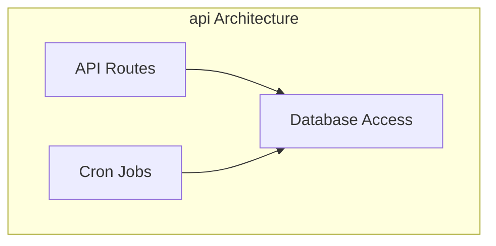
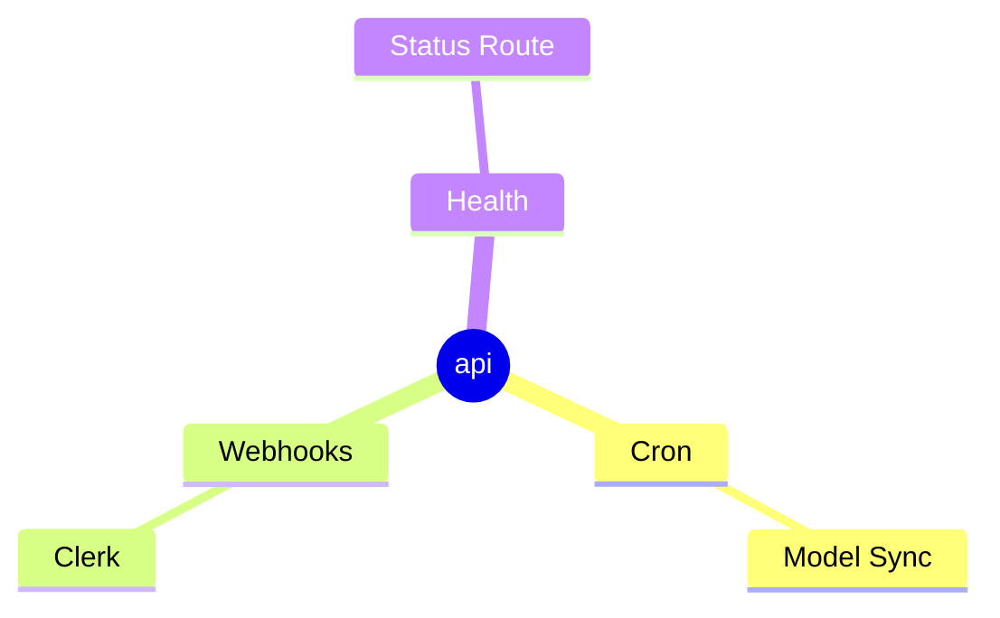

# App Documentation: api

## Overview
- **Purpose**: Exposes server routes for cron jobs, health checks, and webhooks.
- **Business Value**: Central service for background tasks and external integrations.
- **Development Status**: Active
- **Responsible Team/Owner**: Core Backend Team
- **Health Score**: 75/100
- **Security**: Requests pass through Nosecone middleware for bot protection

## Quick Reference
```yaml
name: api
version: 0.0.0
status: active
primary_stack:
  - Next.js 15
  - TypeScript 5
key_dependencies:
  - @repo/database
  - @repo/next-config
  - @repo/security
```

## Core Architecture

### Architecture Diagram


### Architectural Pattern
- **Pattern**: MVC-lite with Next.js route handlers
- **Rationale**: Keep API isolated from UI concerns
- **Implementation Details**: Uses server-only modules under `src/app`
- **Deviations**: Minimal testing, currently no service layer

### Core Modules

#### Module: Cron Routes
- **Purpose**: Schedule scraping and model sync
- **Responsibilities**:
  - Trigger periodic tasks
  - Update database records
- **Key Files**:
  - `src/app/cron/sync-models/route.ts`: sync tasks
- **Dependencies**: `@repo/database`, `@repo/ai`
- **Coupling Assessment**: moderate

#### Module: Webhooks
- **Purpose**: Receive events from Clerk
- **Responsibilities**:
  - Validate webhook signature
  - Update user records
- **Key Files**:
  - `src/app/webhooks/clerk/route.ts`
- **Dependencies**: `@repo/auth`, `@repo/webhooks`
- **Coupling Assessment**: moderate

### State Management
- **Approach**: Database persistence via Prisma
- **State Structure**: N/A (stateless API)
- **Persistence**: PostgreSQL via `@repo/database`
- **Performance Considerations**: Cron routes should be throttled

## Dependencies Analysis

### Dependency Tree
```mermaid
graph TD
  API[api]
  API --> DB[@repo/database]
  API --> NC[@repo/next-config]
  - @repo/security
  API --> Auth[@repo/auth]
  API --> Webhooks[@repo/webhooks]
```

### External Dependencies
| Dependency | Version | Purpose | Health | Last Updated |
|------------|---------|---------|--------|--------------|
| next | 15.x | Server framework | Good | 2025-05 |
| typescript | 5.x | Build tooling | Good | 2025-05 |

### Internal Package Usage
| Package | Import Count | Usage Pattern | Coupling |
|---------|--------------|---------------|----------|
| @repo/database | high | direct calls | moderate |
| @repo/webhooks | low | wrapper | loose |

## Features & Capabilities

### Feature Map


### Feature: Health Check
- **Description**: Returns 200 OK
- **User Value**: Monitoring
- **Technical Implementation**:
  - Entry Point: `src/app/health/route.ts`
  - **Test Coverage**: basic unit tests ensure route handlers validate inputs
- **Known Issues**: none
- **Enhancement Opportunities**: Add metrics

## Data Layer
- Uses `@repo/database` for all queries

## Quality Metrics
- **Test Coverage**: Improved with new unit tests for API utilities
- **Type Coverage**: High via tsconfig

## Development Workflow
```bash
pnpm dev --filter api
pnpm build --filter api
```

## Technical Debt & Issues
| Item | Severity | Impact | Effort | Priority |
|------|----------|--------|--------|----------|
| Missing tests | M | Potential regressions | 2d | High |

## Improvement Roadmap
- [ ] Add integration tests for cron logic
- [ ] Document webhook payload schemas

## Recent Activity
- **Commits**: see git log after entry #2

