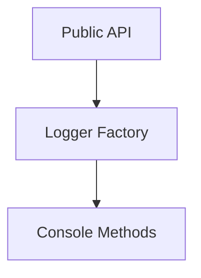

# Package Documentation: logger

## Overview
- **Purpose**: Provides a lightweight console logger for consistent debug output across apps and packages.
- **Type**: Utility
- **Status**: Stable
- **Version**: 0.0.0
- **Owner**: Core Backend Team

## Quick Start
```typescript
// Installation
pnpm add @repo/logger

// Basic usage
import { createLogger } from '@repo/logger'

const log = createLogger()
log.info('Service started')
```

## API Reference

### Exports Overview
```typescript
export { createLogger }
export type { Logger }
```

### Primary API: `createLogger`
#### Signature
```typescript
function createLogger(name?: string): Logger
```

#### Parameters
| Parameter | Type | Required | Description |
|-----------|------|----------|-------------|
| name | string | No | Prefix added to each log message. Defaults to the caller's module name |

#### Returns
- **Type**: `Logger`
- **Description**: Object with `info`, `error`, `warn`, and `debug` methods.

#### Examples
```typescript
const logger = createLogger()
logger.error('Unexpected error', err)
```

#### Edge Cases
- When the module name cannot be derived from the stack trace, `unknown` is used as the prefix.

## Architecture

### Package Structure
```
logger/
├── src/
│   └── index.ts          # Logger factory and interface
├── package.json
└── tsconfig.json
```

### Internal Architecture


## Usage Patterns
- Commonly instantiated per service or module.
- Works in both Node.js and browser environments.

### Anti-Patterns to Avoid
1. **Creating multiple loggers with the same name**: leads to duplicated output.
2. **Using in place of structured logging**: this logger is simple and not a replacement for dedicated log libraries.

## Dependencies

### Direct Dependencies
| Dependency | Version | Purpose | Can be tree-shaken |
|------------|---------|---------|-------------------|
| none | n/a | No external deps | yes |

### Peer Dependencies
| Dependency | Version Range | Required For |
|------------|---------------|--------------|
| none | n/a | n/a |

## Testing
- Unit tests verify log formatting. Run `pnpm --filter @repo/logger test`.

## Recent Changes
- Initial implementation included with api service.
- Adopted in `app` with automatic module detection (2025-06-08).
