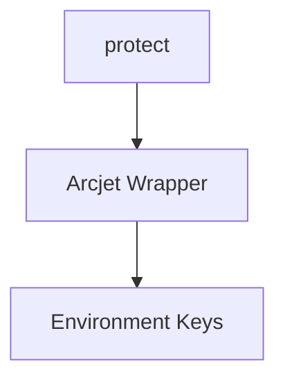

# Package Documentation: security

## Overview
- **Purpose**: Provides Arcjet-based bot detection and rate limiting middleware.
- **Type**: Security utility package for Next.js apps.
- **Status**: Beta
- **Version**: 0.0.0
- **Owner**: Backend Integrations Team

## Quick Start
```typescript
// Installation
pnpm add @repo/security

// Basic usage
import { protect } from '@repo/security'

await protect()
```

## API Reference

### Exports Overview
```typescript
export {
  protect,
}
```

### Primary API: `protect`

#### Signature
```typescript
async function protect(allow?: (ArcjetBotCategory | ArcjetWellKnownBot)[], sourceRequest?: Request): Promise<void>
```

#### Parameters
| Parameter | Type | Required | Description |
|-----------|------|----------|-------------|
| allow | (ArcjetBotCategory \| ArcjetWellKnownBot)[] | No | Allowed bot categories |
| sourceRequest | Request | No | Optional request instance |

#### Returns
- **Type**: `Promise<void>`
- **Description**: Throws error if request is denied

#### Examples
```typescript
await protect(['GoodBots'])
```

#### Edge Cases
- Missing `ARCJET_KEY` results in no protection.

## Architecture

### Package Structure
```
security/
├── index.ts
├── keys.ts
├── middleware.ts
└── tsconfig.json
```

### Design Patterns
- **Pattern Used**: Middleware wrapper
- **Rationale**: Encapsulate security logic for reuse.

### Internal Architecture


## Usage Patterns
- Apply in API routes or middleware for request validation.

## Dependencies

### Direct Dependencies
| Dependency | Version | Purpose | Can be tree-shaken |
|------------|---------|---------|-------------------|
| @arcjet/next | 1.0.0-beta.5 | Bot detection | no |
| @nosecone/next | 1.0.0-beta.5 | Additional protection | no |
| @t3-oss/env-nextjs | ^0.12.0 | Env validation | yes |
| zod | ^3.24.2 | Schema validation | yes |

### Peer Dependencies
| Dependency | Version Range | Required For |
|------------|---------------|--------------|
| none | - | - |

## Testing
- Unit tests verify middleware behavior. Run `pnpm --filter @repo/security test`.

## Recent Changes
- Package introduced prior to entry #3 for unified security.

