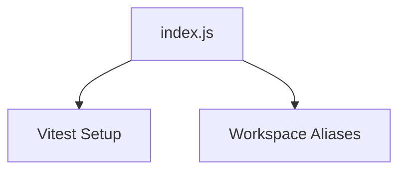

# Package Documentation: testing

## Overview
- **Purpose**: Provides shared Vitest configuration for packages and apps.
- **Type**: Utility configuration package.
- **Status**: Experimental
- **Version**: 0.0.0
- **Owner**: Core Web Team

## Quick Start
```typescript
// Installation
pnpm add -D @repo/testing

// Basic usage
import config from '@repo/testing'
export default config
```

## API Reference

### Exports Overview
```typescript
module.exports = config
```

### Primary API: `config`

#### Signature
```typescript
const config: UserConfigExport
```

#### Parameters
- None

#### Returns
- **Type**: `UserConfigExport`
- **Description**: Vitest configuration object

#### Examples
```typescript
// vitest.config.ts
import config from '@repo/testing'
export default config
```

#### Edge Cases
- Requires node >=18.

## Architecture

### Package Structure
```
testing/
├── index.js
├── tsconfig.json
```

### Design Patterns
- **Pattern Used**: Shared config
- **Rationale**: Centralize test setup across workspaces.

### Internal Architecture


## Usage Patterns
- Import config in each Vitest config file to ensure consistency.

## Dependencies

### Direct Dependencies
| Dependency | Version | Purpose | Can be tree-shaken |
|------------|---------|---------|-------------------|
| @vitejs/plugin-react | ^4.3.4 | React transform for Vitest | yes |
| vitest | ^3.1.1 | Test runner | no |

### Peer Dependencies
| Dependency | Version Range | Required For |
|------------|---------------|--------------|
| none | - | - |

## Testing
- Package not tested itself; used to run tests in other packages.

## Recent Changes
- Introduced for unified Vitest configuration in entry #3 timeframe.

