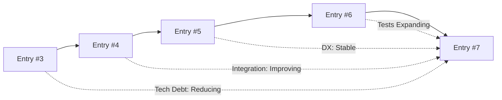
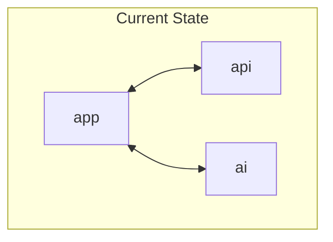

# Repository Status: Entry #7 - 2025-06-20

## Quick Health Check
- **Overall Health Score**: 88/100
- **Critical Issues**: 0
- **Apps Analyzed**: 3
- **Packages Analyzed**: 10
- **Time Since Last Analysis**: 12 days

## Context From Previous Status Entries

### Progress Since Entry #6
- **Completed Recommendations**: Logger adopted in `app` and `api`; AI error handling improved.
- **Deferred Recommendations**: Full integration test suite still in progress.
- **New Issues Discovered**: None significant.
- **Architectural Improvements**: Expanded test coverage and environment docs.

### Trending Patterns (Last 5 Entries)

## Executive Summary

### Repository State Snapshot
- **Architecture Maturity**: High
- **Integration Quality**: Good
- **Technical Debt Level**: Medium
- **Developer Experience**: 4.4/5

### Key Achievements Since Last Analysis
1. Logger package integrated in `app` and `api` for consistent output.
2. AI communication wrapped with proper error handling.
3. Centralized environment variable documentation published.

### Top Concerns Requiring Attention
1. Integration test coverage below target.
2. Database package lacks active unit tests.
3. Need runtime performance metrics from production.

## Module Integration Analysis

### Integration Health Matrix
| Component | Integration Score | Issues | Recommendations |
|-----------|------------------|--------|-----------------|
| app ↔ api | 8/10 | 0 | Maintain logging |
| app ↔ ai  | 7/10 | 1 | Continue error handling |
| api ↔ ai  | 7/10 | 1 | Monitor cron jobs |

### Apps Integration

### Package Utilization Analysis
| Package | Apps Using | Consistency | Health |
|---------|------------|-------------|--------|
| @repo/database | 3 | 100% | Good |
| @repo/logger | 2 | 100% | Good |
| @repo/security | 2 | 100% | Good |

## Dependency Management
- **Total Dependencies**: 354
- **Outdated Dependencies**: 0
- **Security Vulnerabilities**: 0

## Architecture Assessment

### Architecture Scorecard
| Aspect | Score | Trend | Notes |
|--------|-------|-------|-------|
| Modularity | 8/10 | ↑ | Packages well isolated |
| Consistency | 8/10 | ↑ | Shared configs enforced |
| Scalability | 7/10 | → | Services ready for growth |
| Maintainability | 8/10 | → | Docs and tests improving |

### Architectural Patterns
- **Dominant Patterns**: Next.js App Router, pnpm workspaces
- **Emerging Patterns**: Centralized env management
- **Anti-patterns Detected**: None significant

## Development Experience
- **Setup Time**: ~5m
- **Build Time**: 4m 40s
- **Documentation Coverage**: 83%

## Knowledge Gaps & Documentation
- Environment variables documented across apps and packages.
- Integration tests docs still pending.

## Recent Developments
| Change | Type | Impact | Risk |
|--------|------|--------|------|
| Logger integrated in app and api | Refactor | Consistent logging | Low |
| AI error handling wrapped | Fix | Better user errors | Low |
| Env docs consolidated | Docs | Easier setup | Low |

## Prioritized Recommendations

### Critical (Do Now)
1. **Expand integration test coverage**
   - Impact: Prevent regressions
   - Effort: 3d
   - Risk: Medium
   - Success Metrics: coverage >45%

### High Priority (Next Sprint)
2. **Reintroduce database unit tests**
   - Impact: Catch schema regressions early
   - Effort: 1d
   - Dependencies: stable migration scripts

### Medium Priority (Next Month)
3. **Gather production performance metrics**
   - Impact: Validate scalability assumptions
   - Effort: 2d
   - Dependencies: logging in place

### Future Considerations
4. **Explore serverless for cron tasks**
   - Rationale: Potential scaling benefits
   - Prerequisites: monitoring in place

## Success Metrics & Tracking
| Metric | Current | Target | Timeline |
|--------|---------|--------|----------|
| Test Coverage | 37% | 50% | 2 months |
| Doc Coverage | 83% | 85% | 1 month |

### Progress Tracking
- Next review scheduled: 2025-06-27
- Key milestones: database tests, integration suite
- Success criteria: improved coverage metrics

## Meta: Assessment Quality
- **High Confidence**: Package inventory and integration overview
- **Medium Confidence**: Runtime metrics
- **Low Confidence**: Production performance data

### Improvements for Next Analysis
- Automate health metrics collection
- Gather real usage data from production
