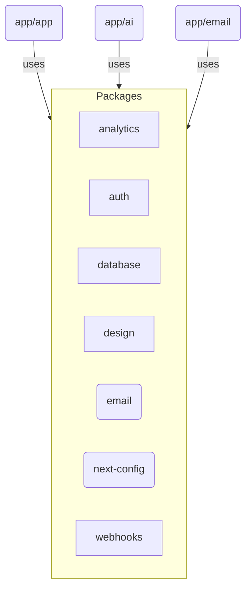

# Turborepo Contributor Guide

## Repository Overview
Arbor-XYZ is a multi-app turborepo using `pnpm` and `turbo` for task orchestration. The repo contains three deployable applications and several shared packages used across those apps.

### Directory Structure
- `apps/` – Next.js and service applications
  - `app/` – main frontend UI and API routes
  - `ai/` – Mastra AI agents and workflows
  - `email/` – React Email preview app
- `packages/` – shared libraries
  - `analytics/`, `auth/`, `database/`, `design/`, `email/`, `next-config/`, `typescript-config/`, `webhooks/`
- `docs/` – architecture and workflow documentation

### Architecture Diagram

## Dev Environment Tips
- **Node**: use version 18 or later
- **Install dependencies**: `pnpm install`
- **Start development**: `pnpm dev`
- **Build all**: `pnpm build`
- **Clean**: `pnpm clean`
- **Add a new app or package**: update `pnpm-workspace.yaml`

## Testing Instructions
- **Run tests for the repo**: `pnpm test`
- **Run tests for a specific workspace**: `pnpm --filter <name> test`
- **CI**: GitHub Actions runs lint, type check and tests on pull requests

## Code Standards
- Format and lint with `pnpm lint` and `pnpm format`
- Type checking via `pnpm typecheck`
- Follow the existing patterns in apps and packages
- Use `@/` path aliases for internal imports instead of relative `../..` paths

## PR Instructions
- Branch names: `feature/<short-description>`
- PR titles: `feat(scope): summary`
- Ensure lint and type checks pass before opening a PR
- Reviewers expect small, focused commits
