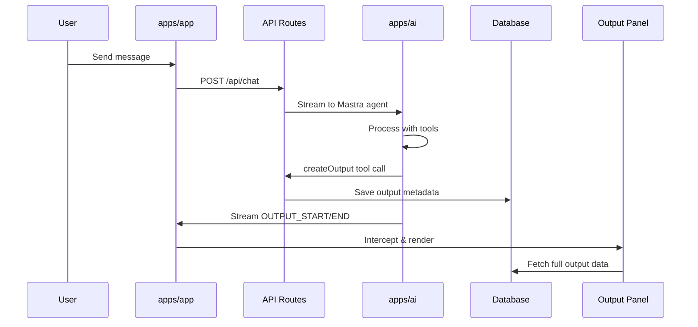
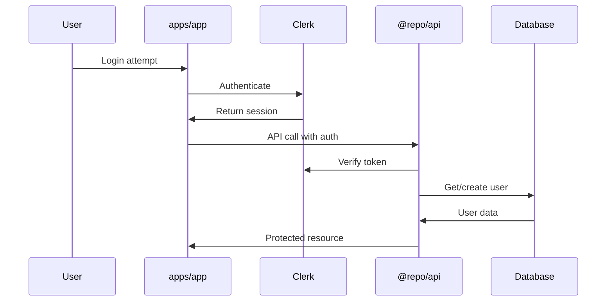

# Apps & Packages Integration Architecture

## Overview

This document details the integration architecture between the three main applications (`@/apps`) and the shared packages (`@/packages`) in the Arbor system. The architecture follows a monorepo pattern with clear separation of concerns and shared utilities.

## System Architecture

```
┌─────────────────────────────────────────────────────────────────┐
│                        Arbor Monorepo                          │
├─────────────────────────────────────────────────────────────────┤
│  Apps Layer                                                     │
│  ┌─────────────┐  ┌─────────────┐  ┌─────────────────────────┐  │
│  │   app/      │  │    api/     │  │        ai/              │  │
│  │ (Frontend)  │  │ (Backend)   │  │ (Mastra Agents)         │  │
│  └─────────────┘  └─────────────┘  └─────────────────────────┘  │
├─────────────────────────────────────────────────────────────────┤
│  Packages Layer (Shared)                                       │
│  ┌─────────┐ ┌─────────┐ ┌─────────┐ ┌─────────┐ ┌─────────┐   │
│  │   api   │ │  auth   │ │database │ │ design  │ │ logger  │   │
│  └─────────┘ └─────────┘ └─────────┘ └─────────┘ └─────────┘   │
│  ┌─────────┐ ┌─────────┐ ┌─────────┐ ┌─────────┐ ┌─────────┐   │
│  │security │ │   seo   │ │webhooks │ │analytics│ │next-cfg │   │
│  └─────────┘ └─────────┘ └─────────┘ └─────────┘ └─────────┘   │
└─────────────────────────────────────────────────────────────────┘
```

## Application Layer Details

### 1. `apps/app` - Frontend Application

**Purpose**: Next.js frontend application providing the user interface for chat, project management, and output visualization.

**Key Responsibilities**:
- User authentication and session management
- Chat interface and message handling
- Output/artifact visualization in dedicated panel
- Project and workspace management
- Real-time streaming and state management

**Package Dependencies**:
```typescript
// Core dependencies
@repo/api          // API services and utilities
@repo/auth         // Clerk authentication
@repo/database     // Prisma client and types
@repo/design       // UI components and styling

// Supporting dependencies
@repo/analytics    // PostHog tracking
@repo/logger       // Structured logging
@repo/next-config  // Next.js configuration
```

**Key Integration Points**:
- **API Routes**: `/app/api/*` - Server-side API endpoints
- **State Management**: Jotai atoms for global state
- **Output System**: Real-time streaming and panel management
- **Authentication**: Clerk integration via `@repo/auth`

### 2. `apps/api` - Backend API Service

**Purpose**: Dedicated API service for external integrations and background processing.

**Key Responsibilities**:
- Model synchronization and management
- Webhook handling (Clerk, external services)
- Cron jobs and scheduled tasks
- Health monitoring and status endpoints

**Package Dependencies**:
```typescript
@repo/api          // Shared API services
@repo/auth         // Authentication utilities
@repo/database     // Database access
@repo/webhooks     // Webhook processing
@repo/logger       // Logging infrastructure
```

**Integration Flow**:
```
External Services → apps/api → @repo/database
                            ↓
                    @repo/webhooks → apps/app (notifications)
```

### 3. `apps/ai` - Mastra AI Agents

**Purpose**: AI agent definitions, tools, and workflows using the Mastra framework.

**Key Responsibilities**:
- Chat agent with tool calling capabilities
- Code generation and analysis agents
- Output creation tools (`createOutput`)
- MCP (Model Context Protocol) integrations
- Workflow definitions and execution

**Key Components**:
```
apps/ai/src/mastra/
├── agents/
│   ├── chat/           # Main chat agent
│   └── code/           # Code analysis agent
├── tools/
│   ├── output-tools/   # Output creation system
│   └── mcp/           # MCP integrations
└── workflows/         # Mastra workflows
```

**Integration with Apps**:
- **apps/app** calls AI agents via API routes
- **Output system** streams content to frontend panel
- **Tool results** stored in database via `@repo/api`

## Package Layer Details

### Core Packages

#### `@repo/api`
**Purpose**: Centralized API services, utilities, and business logic.

**Key Exports**:
```typescript
// Services
export { ChatService } from './services/chat';
export { OutputService } from './services/output';
export { ProjectService } from './services/project';
export { MastraAgentService } from './services/mastra/agent';

// Utilities
export { withAuthenticatedUser } from './utils/auth';
export { withErrorHandling } from './utils/error';
export { ApiResponse } from './utils/response';

// Constants and Types
export { ResourceType, ErrorType } from './constants';
```

**Integration Pattern**:
```typescript
// In apps/app/src/app/api/chat/route.ts
import { 
  withErrorHandling, 
  mastraAgentService, 
  chatService 
} from '@repo/api';

export const POST = withErrorHandling(async (request) => {
  // Business logic using shared services
});
```

#### `@repo/database`
**Purpose**: Prisma client, schema definitions, and database utilities.

**Schema Overview**:
```prisma
model Chat {
  id        String    @id @default(cuid())
  title     String
  userId    String
  projectId String?
  messages  Message[]
  outputs   Output[]
}

model Output {
  id          String          @id @default(cuid())
  title       String
  type        OutputType
  content     String?
  metadata    Json?
  chatId      String
  messageId   String
  versions    OutputVersion[]
}

model OutputVersion {
  id       String @id @default(cuid())
  content  String
  version  String
  outputId String
}
```

#### `@repo/auth`
**Purpose**: Clerk authentication integration and utilities.

**Key Features**:
- Server-side authentication helpers
- Client-side auth components
- Middleware for route protection
- User session management

#### `@repo/design`
**Purpose**: Shared UI components, styling, and design system.

**Component Structure**:
```
components/ui/          # Shadcn/ui components
styles/globals.css      # Global styles and CSS variables
hooks/                  # Shared React hooks
providers/              # Theme and context providers
```

## Data Flow Architecture

### 1. Chat & Output Flow



### 2. Authentication Flow



### 3. Output System Architecture

The output system is designed to handle structured content creation and visualization:

#### Components:
1. **Creation**: `createOutput` tool in `apps/ai`
2. **Streaming**: OUTPUT_START/END markers for real-time content
3. **Storage**: Database persistence via `@repo/api`
4. **Display**: Dedicated output panel in `apps/app`

#### Flow:
```typescript
// 1. AI Agent creates output
const result = await createOutput({
  title: "Generated Code",
  type: "code",
  metadata: { language: "typescript" }
});

// 2. Stream content with markers
`<OUTPUT_START id="${result.id}"/>
${generatedContent}
<OUTPUT_END id="${result.id}"/>`

// 3. Frontend intercepts and routes to panel
useOutputInterceptor(content, isStreaming, messageId);

// 4. Panel fetches full data
const output = await outputService.getOutputById(outputId);
```

## Integration Patterns

### 1. Service Layer Pattern
All business logic is centralized in `@repo/api/services`:

```typescript
// Consistent service interface
export class ChatService {
  async create(userId: string, title: string, projectId?: string) {
    // Implementation
  }
  
  async getMessages(chatId: string) {
    // Implementation
  }
}
```

### 2. Authentication Wrapper Pattern
Protected routes use consistent auth wrapping:

```typescript
export const GET = withAuthenticatedUser(
  async (request, { user, params }) => {
    // Authenticated logic with user context
  }
);
```

### 3. Error Handling Pattern
Consistent error handling across all API routes:

```typescript
export const POST = withErrorHandling(async (request) => {
  // Business logic
  // Errors automatically caught and formatted
});
```

### 4. State Management Pattern
Frontend uses Jotai for reactive state:

```typescript
// Atoms for global state
export const chatOutputsAtom = atom<Output[]>([]);
export const selectedOutputIdAtom = atom<string | null>(null);

// Derived atoms for computed state
export const filteredOutputsAtom = atom((get) => {
  const outputs = get(chatOutputsAtom);
  const chatId = get(currentChatIdAtom);
  return outputs.filter(o => o.chatId === chatId);
});
```

## Configuration & Environment

### Shared Configuration
- **TypeScript**: Shared configs in `@repo/typescript-config`
- **Next.js**: Common config in `@repo/next-config`
- **Environment**: Each app manages its own `.env` with shared validation

### Package Management
- **pnpm workspaces** for efficient dependency management
- **Turbo** for build orchestration and caching
- **Shared dependencies** defined at workspace root

## Security Considerations

### Authentication
- Clerk handles user authentication
- JWT tokens validated on each request
- User context passed through service layer

### API Security
- Rate limiting via middleware
- Input validation using Zod schemas
- CORS configuration for cross-origin requests

### Data Protection
- Sensitive data encrypted at rest
- API keys managed via environment variables
- User data isolation by userId

## Performance Optimizations

### Frontend
- **Code splitting** by route and feature
- **Streaming responses** for real-time updates
- **Optimistic updates** for better UX
- **Jotai** for granular state updates

### Backend
- **Connection pooling** for database
- **Caching** for frequently accessed data
- **Background jobs** for heavy processing
- **Streaming** for large responses

### Build System
- **Turbo caching** for faster builds
- **Incremental builds** for changed packages only
- **Parallel execution** of independent tasks

## Monitoring & Observability

### Logging
- Structured logging via `@repo/logger`
- Consistent log levels and formatting
- Request/response logging for debugging

### Analytics
- User behavior tracking via `@repo/analytics`
- Performance metrics collection
- Error tracking and alerting

### Health Checks
- Application health endpoints
- Database connectivity monitoring
- External service status checks

## Future Considerations

### Scalability
- Microservice extraction patterns
- Database sharding strategies
- CDN integration for static assets

### Development Experience
- Hot module replacement optimization
- Development tooling improvements
- Testing infrastructure expansion

### Feature Expansion
- Plugin architecture for extensions
- Multi-tenant support
- Advanced workflow capabilities

This architecture provides a solid foundation for the Arbor system while maintaining flexibility for future growth and feature additions. 