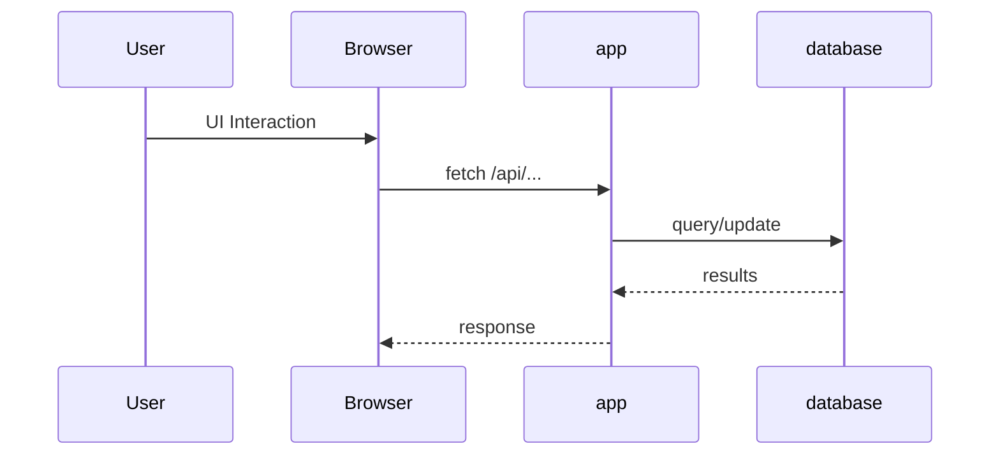

# Data Flow Diagrams

Below is a simplified sequence for a user request.

```mermaid
sequenceDiagram
    participant U as User
    participant B as Browser
    participant A as app
    participant DB as database
    U->>B: UI Interaction
    B->>A: fetch /api/...
    A->>DB: query/update
    DB-->>A: results
    A-->>B: response
```
