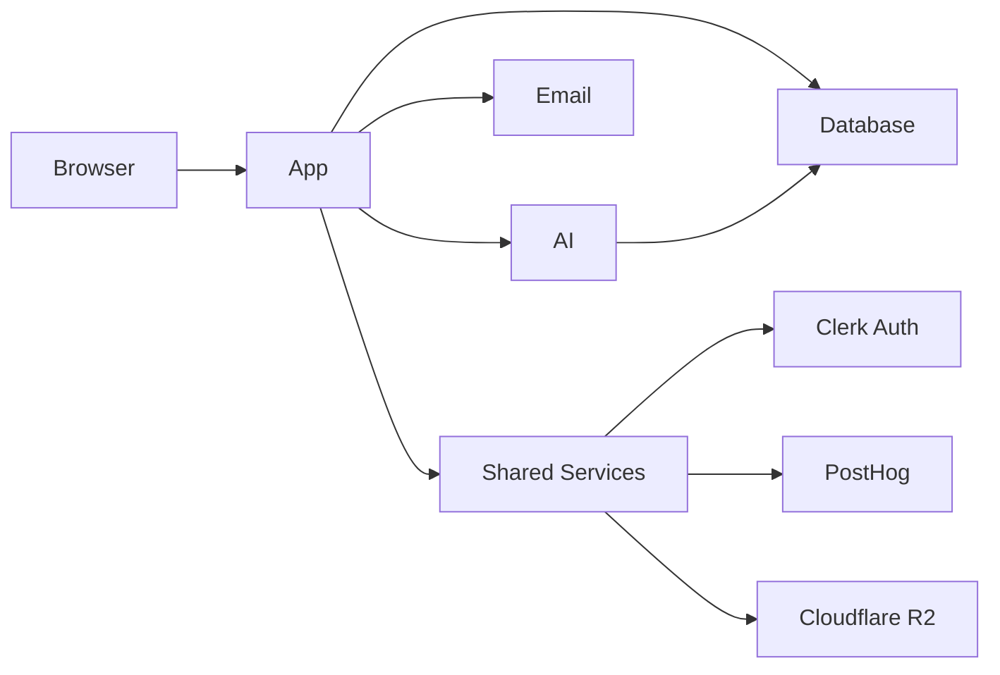

# System Overview

This document provides an overview of the Arbor platform architecture and its integration with the broader AI platform ecosystem.

## Platform Context

Arbor is part of a larger AI platform that includes:
- **[Arbor](../products/arbor/)** - AI Agent Platform (this product)
- **[Kumori](../products/kumori/)** - AI Image Generation Platform

For the complete platform architecture, see:
- [Platform Architecture Overview](platform-overview.md)
- [Shared Services](shared-services.md)
- [Deployment Architecture](deployment-architecture.md)

## Arbor System Architecture

Arbor-XYZ is structured as a turborepo with multiple applications and shared packages.

### Applications
- **app**: Primary Next.js frontend and backend API routes
- **ai**: Mastra AI agent service with memory and tool integration
- **email**: React Email template preview app

### Packages
- **analytics**: Analytics utilities (PostHog integration)
- **auth**: Authentication helpers using Clerk
- **database**: Prisma client and schema
- **design**: Shared UI components
- **email**: Shared email components
- **next-config**: Next.js configuration helpers
- **typescript-config**: Shared TypeScript configuration
- **webhooks**: Webhook handlers for external integrations

### High-Level Data Flow

## Architecture Principles

1. **Modular Design**: Clear separation between apps and packages
2. **Type Safety**: TypeScript throughout with strict configuration
3. **Scalability**: Designed for horizontal scaling
4. **Developer Experience**: Hot reload, type inference, and tooling

## Key Components

### Frontend (App)
- Next.js 15 with App Router
- React 19 with Server Components
- Tailwind CSS for styling
- Framer Motion for animations

### Backend Services
- **API Routes**: Next.js API routes for REST endpoints
- **AI Service**: Mastra-powered agent orchestration
- **Database**: PostgreSQL with Prisma ORM
- **Authentication**: Clerk for user management

### Infrastructure
- **Hosting**: Vercel for frontend and API
- **Database**: Neon PostgreSQL
- **File Storage**: Cloudflare R2
- **Analytics**: PostHog for product analytics

## Integration Points

### Shared Services
Arbor integrates with platform-wide services:
- Authentication (Clerk)
- Analytics (PostHog)
- Storage (Cloudflare R2)
- Monitoring (Sentry)

### External Integrations
- OpenAI/Anthropic for LLM capabilities
- MCP protocol for tool integration
- Webhook support for third-party services

## Security Architecture

- **Authentication**: Clerk with JWT tokens
- **Authorization**: Role-based access control
- **Data Encryption**: At rest and in transit
- **API Security**: Rate limiting and request validation

## Performance Considerations

- **Caching**: Redis for session and data caching
- **CDN**: Cloudflare for static assets
- **Database**: Connection pooling and query optimization
- **API**: Response compression and pagination

## Next Steps

For more detailed information:
- [Data Flow Diagrams](data-flow-diagrams.md)
- [API Documentation](../api/)
- [Deployment Guide](../guides/deployment.md)
