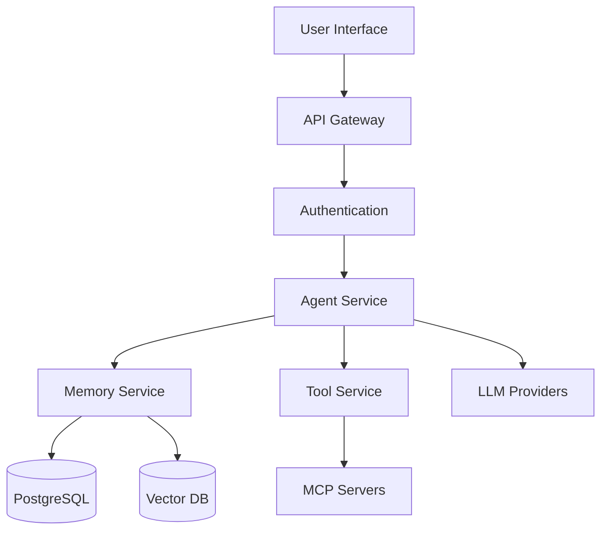

# Arbor Architecture Documentation

## Overview

Arbor is an AI Agent Platform that enables users to build, deploy, and manage intelligent agents with sophisticated memory persistence, tool integration, and real-time collaboration capabilities.

## Architecture Documents

### Core Architecture
- [System Overview](system-overview.md) - High-level architecture and components
- [Agent Architecture](agent-architecture.md) - Agent design and execution model
- [Memory & Persistence](memory-persistence.md) - Memory system and data persistence

### Technical Components
- [API Design](../../../api/) - REST and GraphQL API documentation
- [Database Schema](database-schema.md) - PostgreSQL schema and relationships
- [Real-time Communication](realtime-architecture.md) - WebSocket and event streaming

### Integration & Deployment
- [Tool Integration](tool-integration.md) - MCP protocol and tool ecosystem
- [Deployment Architecture](../../../architecture/deployment-architecture.md) - Infrastructure and scaling
- [Security Model](security-model.md) - Authentication, authorization, and data protection

## Key Features

### 1. Agent Management
- Create and configure AI agents with custom instructions
- Dynamic agent switching and context preservation
- Agent templates and sharing

### 2. Memory System
- **Working Memory**: Real-time context during conversations
- **Long-term Memory**: Persistent storage with semantic search
- **Memory Processors**: Extract and organize information automatically

### 3. Tool Integration
- MCP (Model Context Protocol) support
- Custom tool development
- Tool marketplace (planned)

### 4. Collaboration
- Real-time multi-user sessions
- Shared workspaces
- Version control for agents

## Technology Stack

### Frontend
- **Framework**: Next.js 15 (App Router)
- **UI Library**: React 19
- **Styling**: Tailwind CSS
- **State Management**: Zustand
- **Real-time**: Ably/WebSockets

### Backend
- **Runtime**: Node.js 20
- **Framework**: Next.js API Routes
- **AI Framework**: Mastra
- **Database**: PostgreSQL (Neon)
- **ORM**: Prisma

### Infrastructure
- **Hosting**: Vercel
- **Database**: Neon PostgreSQL
- **File Storage**: Cloudflare R2
- **Analytics**: PostHog
- **Monitoring**: Sentry

## Architecture Principles

1. **Modularity**: Clear separation of concerns with packages
2. **Scalability**: Horizontal scaling for all components
3. **Type Safety**: TypeScript everywhere with strict mode
4. **Developer Experience**: Fast iteration with hot reload
5. **Security First**: Zero-trust architecture

## Data Flow

## Getting Started

1. Review the [System Overview](system-overview.md)
2. Understand the [Agent Architecture](agent-architecture.md)
3. Explore the [Memory System](memory-persistence.md)
4. Check the [API Documentation](../../../api/)

## Related Documentation

- [Platform Architecture](../../../architecture/) - Overall platform design
- [Kumori Architecture](../../kumori/architecture/) - Sister product architecture
- [Shared Services](../../../architecture/shared-services.md) - Common infrastructure