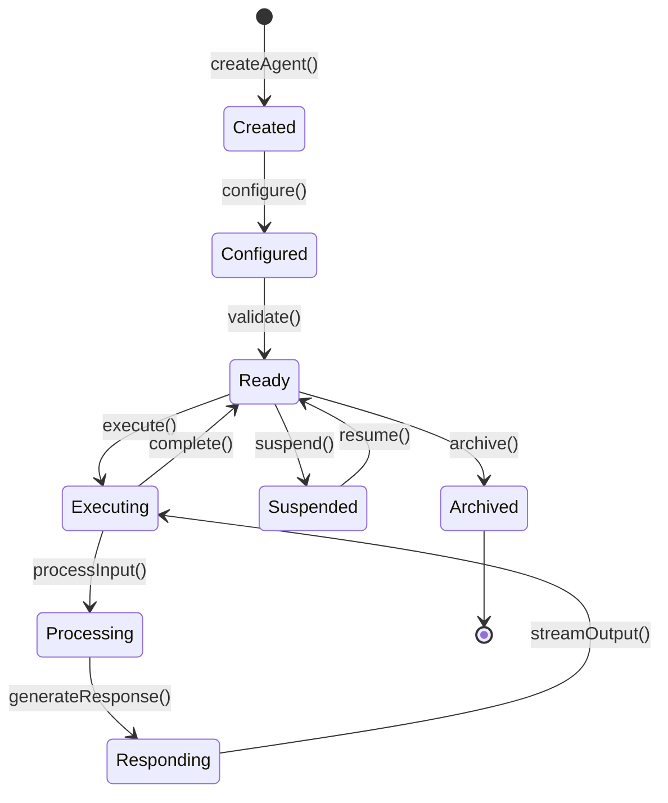

# Agent Architecture

## Overview

The Agent Architecture in Arbor is designed to provide a flexible, scalable, and powerful framework for creating and managing AI agents. This document details the core components, execution model, and design patterns used in the agent system.

## Agent Lifecycle



## Core Agent Components

### 1. Agent Definition

```typescript
// Core agent structure
interface AgentDefinition {
  // Identity
  id: string;
  name: string;
  description: string;
  avatar?: string;
  
  // Configuration
  model: {
    provider: 'openai' | 'anthropic' | 'google';
    name: string;
    parameters: ModelParameters;
  };
  
  // Behavior
  instructions: string;
  systemPrompt?: string;
  examples?: ConversationExample[];
  
  // Capabilities
  tools: ToolReference[];
  memory: MemoryConfiguration;
  
  // Execution
  timeout?: number;
  maxRetries?: number;
  errorHandling?: ErrorStrategy;
}

interface ModelParameters {
  temperature: number;
  maxTokens: number;
  topP?: number;
  frequencyPenalty?: number;
  presencePenalty?: number;
  stopSequences?: string[];
}
```

### 2. Agent Executor

```typescript
// Agent execution engine
class AgentExecutor {
  private agent: Agent;
  private llmClient: LLMClient;
  private memoryService: MemoryService;
  private toolService: ToolService;
  
  async execute(input: AgentInput): Promise<AgentOutput> {
    // 1. Prepare context
    const context = await this.prepareContext(input);
    
    // 2. Load relevant memories
    const memories = await this.loadMemories(context);
    
    // 3. Build prompt
    const prompt = this.buildPrompt(context, memories);
    
    // 4. Execute with tools
    const response = await this.executeWithTools(prompt);
    
    // 5. Process response
    const output = await this.processResponse(response);
    
    // 6. Update memory
    await this.updateMemory(input, output);
    
    return output;
  }
  
  private async executeWithTools(prompt: Prompt): Promise<LLMResponse> {
    const tools = await this.toolService.getAgentTools(this.agent.id);
    
    return await this.llmClient.complete({
      messages: prompt.messages,
      tools: tools.map(t => t.definition),
      toolChoice: 'auto',
      stream: true,
      onToolCall: async (call) => {
        return await this.toolService.execute(call.name, call.arguments);
      }
    });
  }
}
```

### 3. Context Management

```typescript
// Context builder for agent execution
class ContextBuilder {
  build(input: AgentInput, agent: Agent): ExecutionContext {
    return {
      // User context
      user: {
        id: input.userId,
        session: input.sessionId,
        metadata: input.userMetadata,
      },
      
      // Agent context
      agent: {
        id: agent.id,
        instructions: agent.instructions,
        capabilities: this.getCapabilities(agent),
      },
      
      // Conversation context
      conversation: {
        threadId: input.threadId,
        history: input.history || [],
        currentMessage: input.message,
      },
      
      // Environmental context
      environment: {
        timestamp: new Date(),
        timezone: input.timezone,
        locale: input.locale,
      },
    };
  }
}
```

## Memory Integration

### 1. Memory-Augmented Generation

```typescript
// Memory-aware prompt construction
class MemoryAugmentedPrompt {
  async build(
    context: ExecutionContext,
    memories: Memory[]
  ): Promise<Prompt> {
    const relevantMemories = this.filterRelevantMemories(memories, context);
    const summarizedMemories = await this.summarizeMemories(relevantMemories);
    
    return {
      messages: [
        {
          role: 'system',
          content: this.buildSystemPrompt(context.agent, summarizedMemories),
        },
        ...this.buildConversationHistory(context.conversation),
        {
          role: 'user',
          content: context.conversation.currentMessage,
        },
      ],
      metadata: {
        memoryCount: relevantMemories.length,
        contextTokens: this.countTokens(summarizedMemories),
      },
    };
  }
  
  private buildSystemPrompt(
    agent: AgentConfig,
    memories: SummarizedMemory[]
  ): string {
    return `
${agent.instructions}

## Relevant Context from Previous Conversations:
${memories.map(m => `- ${m.summary}`).join('\n')}

## Available Capabilities:
${agent.capabilities.map(c => `- ${c.name}: ${c.description}`).join('\n')}
    `.trim();
  }
}
```

### 2. Memory Processing Pipeline

```typescript
// Post-execution memory processing
class MemoryProcessor {
  async process(
    input: AgentInput,
    output: AgentOutput,
    context: ExecutionContext
  ): Promise<void> {
    // 1. Extract key information
    const extraction = await this.extractInformation(input, output);
    
    // 2. Generate embeddings
    const embeddings = await this.generateEmbeddings(extraction.content);
    
    // 3. Store in memory
    await this.memoryService.store({
      agentId: context.agent.id,
      threadId: context.conversation.threadId,
      content: extraction.content,
      summary: extraction.summary,
      entities: extraction.entities,
      embedding: embeddings,
      metadata: {
        tokens: extraction.tokens,
        importance: extraction.importance,
        timestamp: new Date(),
      },
    });
    
    // 4. Update working memory
    await this.updateWorkingMemory(context, extraction);
  }
}
```

## Tool Integration

### 1. Tool Orchestration

```typescript
// Tool execution and result handling
class ToolOrchestrator {
  private toolRegistry: ToolRegistry;
  private rateLimiter: RateLimiter;
  
  async executeTool(
    call: ToolCall,
    context: ExecutionContext
  ): Promise<ToolResult> {
    // 1. Validate tool availability
    const tool = await this.toolRegistry.getTool(call.name);
    if (!tool) {
      throw new ToolNotFoundError(call.name);
    }
    
    // 2. Check permissions
    if (!this.hasPermission(context.user, tool)) {
      throw new ToolPermissionError(tool.name);
    }
    
    // 3. Rate limiting
    await this.rateLimiter.checkLimit(context.user.id, tool.id);
    
    // 4. Validate parameters
    const validatedParams = await this.validateParameters(
      tool.schema,
      call.arguments
    );
    
    // 5. Execute tool
    try {
      const result = await tool.execute(validatedParams, context);
      
      // 6. Process result
      return this.processToolResult(result, tool);
    } catch (error) {
      return this.handleToolError(error, tool, context);
    }
  }
}
```

### 2. MCP Integration

```typescript
// MCP server integration for tools
class MCPToolAdapter {
  private mcpClient: MCPClient;
  
  async connectToServer(serverUrl: string): Promise<MCPServer> {
    const connection = await this.mcpClient.connect(serverUrl);
    
    // Discover available tools
    const tools = await connection.listTools();
    
    // Register tools with the system
    for (const tool of tools) {
      await this.registerMCPTool(tool, connection);
    }
    
    return connection;
  }
  
  private async registerMCPTool(
    mcpTool: MCPToolDefinition,
    server: MCPServer
  ): Promise<void> {
    const adapter = {
      id: `mcp:${server.id}:${mcpTool.name}`,
      name: mcpTool.name,
      description: mcpTool.description,
      schema: mcpTool.inputSchema,
      
      execute: async (params: any) => {
        return await server.callTool(mcpTool.name, params);
      },
    };
    
    await this.toolRegistry.register(adapter);
  }
}
```

## Streaming Architecture

### 1. Response Streaming

```typescript
// Streaming response handler
class StreamingResponseHandler {
  async *handleStream(
    llmStream: AsyncIterable<LLMChunk>,
    context: ExecutionContext
  ): AsyncGenerator<AgentEvent> {
    let buffer = '';
    let currentToolCall: ToolCall | null = null;
    
    for await (const chunk of llmStream) {
      // Handle different chunk types
      switch (chunk.type) {
        case 'text':
          buffer += chunk.content;
          yield {
            type: 'text',
            content: chunk.content,
            timestamp: Date.now(),
          };
          break;
          
        case 'tool_call_start':
          currentToolCall = {
            id: chunk.id,
            name: chunk.name,
            arguments: '',
          };
          yield {
            type: 'tool_call_start',
            tool: chunk.name,
            timestamp: Date.now(),
          };
          break;
          
        case 'tool_call_arguments':
          if (currentToolCall) {
            currentToolCall.arguments += chunk.content;
          }
          break;
          
        case 'tool_call_end':
          if (currentToolCall) {
            const result = await this.executeTool(currentToolCall, context);
            yield {
              type: 'tool_result',
              tool: currentToolCall.name,
              result: result,
              timestamp: Date.now(),
            };
            currentToolCall = null;
          }
          break;
      }
    }
    
    // Final processing
    yield {
      type: 'complete',
      content: buffer,
      usage: await this.calculateUsage(buffer, context),
      timestamp: Date.now(),
    };
  }
}
```

### 2. Real-time Updates

```typescript
// Real-time event broadcasting
class RealtimeAgentEvents {
  private eventEmitter: EventEmitter;
  
  async broadcastAgentEvent(
    agentId: string,
    event: AgentEvent,
    subscribers: string[]
  ): Promise<void> {
    // Enrich event with metadata
    const enrichedEvent = {
      ...event,
      agentId,
      timestamp: Date.now(),
      sequenceNumber: this.getNextSequence(agentId),
    };
    
    // Broadcast to subscribers
    for (const subscriberId of subscribers) {
      await this.eventEmitter.emit(
        `agent:${agentId}:${subscriberId}`,
        enrichedEvent
      );
    }
    
    // Store event for replay
    await this.storeEvent(enrichedEvent);
  }
}
```

## Error Handling

### 1. Graceful Degradation

```typescript
// Error handling strategies
class AgentErrorHandler {
  async handle(
    error: Error,
    context: ExecutionContext,
    strategy: ErrorStrategy
  ): Promise<AgentOutput> {
    switch (strategy) {
      case 'retry':
        return await this.retryWithBackoff(context);
        
      case 'fallback':
        return await this.executeFallback(context);
        
      case 'graceful':
        return this.createGracefulResponse(error, context);
        
      case 'strict':
        throw new AgentExecutionError(error, context);
        
      default:
        return this.defaultErrorResponse(error);
    }
  }
  
  private createGracefulResponse(
    error: Error,
    context: ExecutionContext
  ): AgentOutput {
    return {
      content: "I encountered an issue while processing your request. Let me try a different approach.",
      metadata: {
        error: error.message,
        recovered: true,
        strategy: 'graceful',
      },
      alternatives: this.suggestAlternatives(error, context),
    };
  }
}
```

### 2. Circuit Breaker

```typescript
// Circuit breaker for external services
class AgentCircuitBreaker {
  private states = new Map<string, CircuitState>();
  
  async executeWithBreaker<T>(
    serviceId: string,
    operation: () => Promise<T>
  ): Promise<T> {
    const state = this.getState(serviceId);
    
    if (state.isOpen()) {
      throw new ServiceUnavailableError(serviceId);
    }
    
    try {
      const result = await operation();
      state.onSuccess();
      return result;
    } catch (error) {
      state.onFailure();
      
      if (state.shouldOpen()) {
        state.open();
        this.scheduleReset(serviceId);
      }
      
      throw error;
    }
  }
}
```

## Performance Optimization

### 1. Prompt Caching

```typescript
// Intelligent prompt caching
class PromptCache {
  private cache: LRUCache<string, CachedPrompt>;
  
  async getCachedResponse(
    prompt: Prompt,
    context: ExecutionContext
  ): Promise<CachedResponse | null> {
    const cacheKey = this.generateCacheKey(prompt, context);
    const cached = this.cache.get(cacheKey);
    
    if (!cached) return null;
    
    // Validate cache freshness
    if (this.isCacheValid(cached, context)) {
      return cached.response;
    }
    
    // Invalidate stale cache
    this.cache.delete(cacheKey);
    return null;
  }
  
  private generateCacheKey(
    prompt: Prompt,
    context: ExecutionContext
  ): string {
    return crypto
      .createHash('sha256')
      .update(JSON.stringify({
        messages: prompt.messages,
        agentId: context.agent.id,
        tools: context.agent.capabilities,
      }))
      .digest('hex');
  }
}
```

### 2. Parallel Execution

```typescript
// Parallel tool execution
class ParallelExecutor {
  async executeTools(
    calls: ToolCall[],
    context: ExecutionContext
  ): Promise<ToolResult[]> {
    // Group independent tools
    const groups = this.groupIndependentTools(calls);
    
    const results: ToolResult[] = [];
    
    // Execute each group in parallel
    for (const group of groups) {
      const groupResults = await Promise.all(
        group.map(call => this.executeTool(call, context))
      );
      results.push(...groupResults);
    }
    
    return results;
  }
  
  private groupIndependentTools(calls: ToolCall[]): ToolCall[][] {
    // Analyze dependencies and group tools that can run in parallel
    const graph = this.buildDependencyGraph(calls);
    return this.topologicalSort(graph);
  }
}
```

## Agent Templates

### 1. Template System

```typescript
// Agent template definition
interface AgentTemplate {
  id: string;
  name: string;
  category: 'assistant' | 'analyst' | 'creative' | 'technical';
  description: string;
  
  // Base configuration
  baseConfig: {
    model: ModelConfig;
    instructions: string;
    tools: string[];
    memory: MemoryConfiguration;
  };
  
  // Customization points
  variables: TemplateVariable[];
  
  // Example usage
  examples: {
    input: string;
    expectedOutput: string;
  }[];
}

// Template instantiation
class TemplateInstantiator {
  async createFromTemplate(
    templateId: string,
    customization: Record<string, any>
  ): Promise<Agent> {
    const template = await this.templateRegistry.get(templateId);
    
    // Apply customizations
    const config = this.applyCustomizations(
      template.baseConfig,
      customization,
      template.variables
    );
    
    // Create agent
    return await this.agentService.create({
      ...config,
      metadata: {
        templateId,
        templateVersion: template.version,
      },
    });
  }
}
```

## Monitoring & Analytics

### 1. Agent Metrics

```typescript
// Agent performance metrics
interface AgentMetrics {
  execution: {
    totalExecutions: number;
    averageLatency: number;
    p95Latency: number;
    errorRate: number;
  };
  
  tokens: {
    totalInput: number;
    totalOutput: number;
    averagePerExecution: number;
    costEstimate: number;
  };
  
  tools: {
    usage: Map<string, number>;
    successRate: Map<string, number>;
    averageLatency: Map<string, number>;
  };
  
  memory: {
    totalMemories: number;
    retrievalCount: number;
    hitRate: number;
  };
}
```

### 2. Analytics Pipeline

```typescript
// Analytics collection and processing
class AgentAnalytics {
  async recordExecution(
    execution: AgentExecution,
    result: AgentOutput
  ): Promise<void> {
    const metrics = {
      agentId: execution.agentId,
      userId: execution.userId,
      duration: result.duration,
      tokens: result.usage,
      tools: result.toolCalls,
      success: !result.error,
      timestamp: Date.now(),
    };
    
    // Real-time metrics
    await this.metricsCollector.record(metrics);
    
    // Batch analytics
    await this.analyticsQueue.enqueue(metrics);
    
    // Update dashboards
    await this.updateDashboards(execution.agentId, metrics);
  }
}
```

## Best Practices

1. **Instruction Design**: Clear, specific instructions improve agent performance
2. **Tool Selection**: Only enable necessary tools to reduce complexity
3. **Memory Management**: Regular memory pruning for optimal performance
4. **Error Handling**: Always implement graceful degradation
5. **Testing**: Comprehensive testing with various inputs and edge cases

## Future Enhancements

1. **Multi-Agent Collaboration**: Agents working together on complex tasks
2. **Adaptive Learning**: Agents improving from user feedback
3. **Custom Model Integration**: Support for fine-tuned models
4. **Visual Understanding**: Multi-modal agents with image capabilities
5. **Autonomous Agents**: Self-directed agents with goals