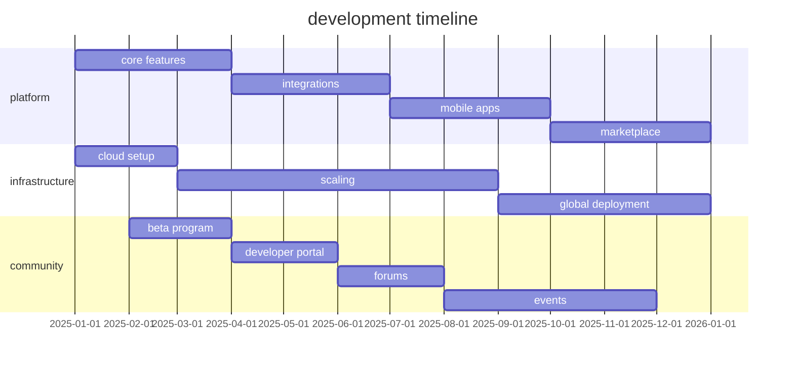

# roadmap 2025

comprehensive development plan for arbor's evolution into a complete ai ecosystem.

## vision

combining intelligent chat, agents, and creative tools into the definitive platform for ai-powered applications.

## q1 2025: foundation

### core platform

<CardGroup cols={2}>
  <Card title="architecture" icon="building">
    - scalable cloud-native infrastructure
    - distributed processing pipeline
    - edge computing capabilities
    - version control system
  </Card>
  
  <Card title="ai features" icon="sparkles">
    - multi-model chat support
    - agent orchestration
    - memory persistence
    - tool integration (mcp)
  </Card>
  
  <Card title="user interface" icon="palette">
    - visual-first design
    - infinite canvas exploration
    - intelligent prompt assistance
    - history and favorites
  </Card>
  
  <Card title="developer tools" icon="code">
    - restful api launch
    - authentication system
    - comprehensive docs
    - developer portal
  </Card>
</CardGroup>

### milestones

<Steps>
  <Step title="beta launch">
    closed beta for select developers
  </Step>
  <Step title="api v1.0">
    public api release with documentation
  </Step>
  <Step title="web platform">
    production-ready web application
  </Step>
</Steps>

## q2 2025: integration

### advanced capabilities

<Tabs>
  <Tab title="ai optimization">
    - fine-tuned models for specific domains
    - multi-modal fusion (text + image + code)
    - contextual understanding
    - adaptive processing
  </Tab>
  
  <Tab title="creative control">
    - advanced prompt engineering
    - region-specific control
    - style constraints
    - iterative refinement
  </Tab>
  
  <Tab title="collaboration">
    - team workspaces
    - real-time collaboration
    - project management
    - cloud storage integration
  </Tab>
</Tabs>

### integrations

<CardGroup cols={3}>
  <Card title="ide plugins" icon="plug">
    - vs code extension
    - cursor integration
    - jetbrains support
  </Card>
  
  <Card title="design tools" icon="pen-tool">
    - figma plugin
    - adobe creative suite
    - sketch compatibility
  </Card>
  
  <Card title="productivity" icon="briefcase">
    - slack integration
    - notion sync
    - linear tracking
  </Card>
</CardGroup>

## q3 2025: mobile expansion

### native applications

<Tabs>
  <Tab title="ios app">
    ```swift
    // swiftui native app
    - on-device processing
    - seamless sync
    - apple pencil support
    - widgets and shortcuts
    ```
  </Tab>
  
  <Tab title="android app">
    ```kotlin
    // kotlin native app
    - feature parity
    - material design
    - stylus support
    - offline mode
    ```
  </Tab>
  
  <Tab title="desktop daemon">
    ```rust
    // tauri desktop app
    - local file integration
    - system tray access
    - keyboard shortcuts
    - native performance
    ```
  </Tab>
</Tabs>

### enterprise features

<Card title="enterprise suite" icon="building-2">
  - **sso integration**: okta, auth0, azure ad
  - **user management**: rbac, teams, permissions
  - **analytics**: usage reports, cost tracking
  - **sla**: 99.9% uptime guarantee
  - **compliance**: soc2, gdpr, hipaa ready
</Card>

## q4 2025: ecosystem

### marketplace

<CardGroup cols={2}>
  <Card title="model marketplace" icon="store">
    - custom model sharing
    - revenue sharing for creators
    - quality verification
    - usage analytics
  </Card>
  
  <Card title="plugin ecosystem" icon="puzzle">
    - community plugins
    - official integrations
    - developer rewards
    - certification program
  </Card>
</CardGroup>

### community features

<Steps>
  <Step title="forums">
    community discussion platform
  </Step>
  <Step title="tutorials">
    interactive learning paths
  </Step>
  <Step title="showcases">
    featured projects gallery
  </Step>
  <Step title="events">
    hackathons and workshops
  </Step>
</Steps>

## 2026: scale & innovation

### technical innovations

<Tabs>
  <Tab title="performance">
    - **10x speed**: optimized inference
    - **edge deployment**: local processing
    - **real-time**: < 100ms latency
    - **efficiency**: 50% cost reduction
  </Tab>
  
  <Tab title="capabilities">
    - **multimodal**: text, image, audio, video
    - **long context**: 1m+ tokens
    - **memory**: persistent across sessions
    - **reasoning**: chain-of-thought
  </Tab>
  
  <Tab title="platform">
    - **global**: multi-region deployment
    - **scale**: millions of users
    - **reliability**: 99.99% uptime
    - **security**: zero-trust architecture
  </Tab>
</Tabs>

### new products

<CardGroup cols={2}>
  <Card title="arbor studio" icon="video">
    professional creative suite
  </Card>
  
  <Card title="arbor cloud" icon="cloud">
    managed ai infrastructure
  </Card>
  
  <Card title="arbor edge" icon="cpu">
    on-premise deployment
  </Card>
  
  <Card title="arbor labs" icon="flask">
    experimental features
  </Card>
</CardGroup>

## key metrics

### success indicators

| metric | q1 2025 | q2 2025 | q3 2025 | q4 2025 |
|--------|---------|---------|---------|---------|
| **users** | 1k | 10k | 50k | 200k |
| **api calls/day** | 10k | 100k | 500k | 2m |
| **revenue** | $10k | $50k | $200k | $500k |
| **uptime** | 99% | 99.5% | 99.9% | 99.9% |

### development velocity



## investment areas

### technology

<CardGroup cols={3}>
  <Card title="ai research" icon="brain">
    40% of r&d budget
  </Card>
  
  <Card title="infrastructure" icon="server">
    30% of r&d budget
  </Card>
  
  <Card title="product" icon="package">
    30% of r&d budget
  </Card>
</CardGroup>

### team growth

| role | q1 | q2 | q3 | q4 |
|------|----|----|----|----|
| **engineering** | 5 | 10 | 15 | 25 |
| **ai/ml** | 2 | 4 | 6 | 10 |
| **design** | 1 | 2 | 3 | 5 |
| **devrel** | 1 | 2 | 3 | 5 |

## risks & mitigation

<AccordionGroup>
  <Accordion title="technical risks">
    - **scaling challenges**: implement gradual rollout
    - **model costs**: optimize inference, caching
    - **latency issues**: edge deployment, cdn
    - **security threats**: regular audits, bug bounty
  </Accordion>
  
  <Accordion title="market risks">
    - **competition**: focus on unique value
    - **pricing pressure**: flexible pricing models
    - **adoption rate**: strong developer relations
    - **regulatory**: compliance preparation
  </Accordion>
  
  <Accordion title="operational risks">
    - **talent acquisition**: competitive compensation
    - **technical debt**: regular refactoring
    - **dependency risks**: multi-provider strategy
    - **burnout**: sustainable pace
  </Accordion>
</AccordionGroup>

## next steps

<CardGroup cols={2}>
  <Card title="get involved" icon="users" href="/community">
    join the beta program
  </Card>
  
  <Card title="documentation" icon="book" href="/introduction">
    explore the platform
  </Card>
  
  <Card title="api access" icon="key" href="/quickstart">
    start building today
  </Card>
  
  <Card title="contact" icon="envelope" href="mailto:team@arbor.app">
    reach out to the team
  </Card>
</CardGroup>