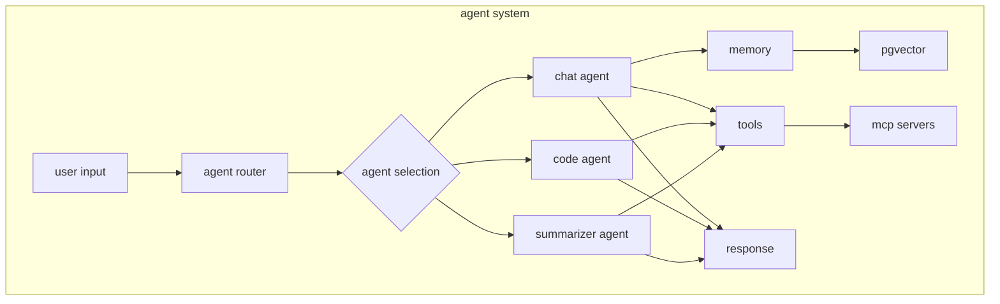

# agents

arbor's ai agents provide specialized capabilities for different tasks.

## available agents

### chat agent

<Card title="chat agent" icon="message">
  general-purpose conversational ai with memory and tool access.
  
  **capabilities:**
  - natural language understanding
  - contextual memory
  - tool calling
  - streaming responses
  - multi-turn conversations
  
  **configuration:**
  ```typescript
  const chatAgent = new Agent({
    name: 'chat',
    model: 'gpt-4o',
    temperature: 0.7,
    tools: ['search', 'calculator', 'code'],
    memoryOptions: {
      lastMessages: 20,
      semanticRecall: { topK: 3 }
    }
  })
  ```
</Card>

### code agent

<Card title="code agent" icon="code">
  specialized for software development tasks.
  
  **capabilities:**
  - code generation
  - debugging assistance
  - refactoring suggestions
  - documentation writing
  - test creation
  
  **supported languages:**
  - typescript/javascript
  - python
  - rust
  - go
  - swift
  - and more...
  
  **example usage:**
  ```typescript
  const response = await codeAgent.run({
    prompt: "create a react component for user authentication",
    context: {
      framework: "next.js",
      styling: "tailwind",
      typescript: true
    }
  })
  ```
</Card>

### summarizer agent

<Card title="summarizer agent" icon="file-text">
  extract key information from documents and urls.
  
  **capabilities:**
  - document summarization
  - key point extraction
  - sentiment analysis
  - topic classification
  - multi-document synthesis
  
  **input types:**
  - plain text
  - markdown
  - pdfs
  - web pages
  - code files
</Card>

## agent architecture



## memory system

### conversation memory

<Tabs>
  <Tab title="short-term">
    ```typescript
    // last n messages
    memoryOptions: {
      lastMessages: 20,
      includeSystemMessages: false
    }
    ```
  </Tab>
  
  <Tab title="semantic">
    ```typescript
    // vector similarity search
    memoryOptions: {
      semanticRecall: {
        topK: 5,
        threshold: 0.7
      }
    }
    ```
  </Tab>
  
  <Tab title="persistent">
    ```typescript
    // database storage
    memoryOptions: {
      threadId: 'thread_123',
      resourceId: 'user_456',
      persist: true
    }
    ```
  </Tab>
</Tabs>

### memory configuration

```typescript
// apps/ai/src/mastra/agents/chat/index.ts
export const chatAgent = new Agent({
  name: 'chat',
  instructions: loadInstructions(),
  model: getModel(),
  tools: loadTools(),
  memory: {
    provider: 'pgvector',
    config: {
      connectionString: DATABASE_URL,
      tableName: 'memory_store',
      embeddingDimension: 1536
    }
  }
})
```

## tools & capabilities

### mcp tools

arbor integrates with model context protocol (mcp) for extended capabilities:

<CardGroup cols={2}>
  <Card title="filesystem" icon="folder">
    read/write local files
  </Card>
  
  <Card title="github" icon="github">
    repository operations
  </Card>
  
  <Card title="database" icon="database">
    query execution
  </Card>
  
  <Card title="web search" icon="search">
    internet search
  </Card>
</CardGroup>

### custom tools

create custom tools for agents:

```typescript
// apps/ai/src/mastra/tools/custom-tool.ts
import { Tool } from '@mastra/core';
import { z } from 'zod';

export const customTool = new Tool({
  name: 'custom-tool',
  description: 'description for the agent',
  inputSchema: z.object({
    param: z.string().describe('parameter description')
  }),
  execute: async ({ param }) => {
    // tool logic here
    return { result: 'success' };
  }
});
```

### tool registration

```typescript
// apps/ai/src/mastra/index.ts
import { Mastra } from '@mastra/core';

export const mastra = new Mastra({
  agents: {
    chat: chatAgent,
    code: codeAgent,
    summarizer: summarizerAgent
  },
  tools: {
    ...mcpTools,
    customTool,
    calculator,
    webSearch
  }
});
```

## agent instructions

### instruction format

agents use xml-formatted instructions for clarity:

```xml
<instructions>
  <role>
    you are a helpful ai assistant specializing in software development.
  </role>
  
  <capabilities>
    - write clean, maintainable code
    - explain complex concepts clearly
    - debug and fix issues
    - suggest improvements
  </capabilities>
  
  <guidelines>
    - be concise and direct
    - use examples when helpful
    - admit uncertainty
    - prioritize security
  </guidelines>
  
  <constraints>
    - no malicious code
    - respect user privacy
    - stay within scope
  </constraints>
</instructions>
```

### dynamic instructions

load instructions based on context:

```typescript
const loadInstructions = (context?: AgentContext) => {
  const base = readFileSync('instructions.xml', 'utf-8');
  
  if (context?.mode === 'debug') {
    return base + '<debug>provide detailed error analysis</debug>';
  }
  
  return base;
};
```

## streaming responses

### server-sent events

```typescript
// streaming response handler
const stream = await agent.stream(prompt, {
  threadId,
  resourceId: user.clerkId,
  onToken: (token) => {
    // handle each token
  },
  onToolCall: (tool, args) => {
    // handle tool calls
  },
  onComplete: (response) => {
    // final response
  }
});
```

### client consumption

```typescript
// client-side streaming
const response = await fetch('/api/chat/stream', {
  method: 'POST',
  body: JSON.stringify({ messages }),
  headers: { 'Content-Type': 'application/json' }
});

const reader = response.body.getReader();
const decoder = new TextDecoder();

while (true) {
  const { done, value } = await reader.read();
  if (done) break;
  
  const chunk = decoder.decode(value);
  // process streaming chunk
}
```

## agent configuration

### environment variables

```env
# apps/ai/.env.local

# model configuration
DEFAULT_MODEL=gpt-4o
TEMPERATURE=0.7
MAX_TOKENS=4096

# memory settings
MEMORY_ENABLED=true
SEMANTIC_SEARCH=true
MEMORY_WINDOW=20

# tool access
ENABLE_MCP_TOOLS=true
ENABLE_WEB_SEARCH=true
ENABLE_CODE_EXECUTION=false
```

### runtime configuration

```typescript
// dynamic agent configuration
const agent = mastra.getAgent('chat', {
  model: userSettings.preferredModel || 'gpt-4o',
  temperature: userSettings.temperature || 0.7,
  tools: userSettings.enabledTools || ['search', 'calculator'],
  memoryOptions: {
    lastMessages: userSettings.memoryWindow || 20
  }
});
```

## performance optimization

### lazy initialization

```typescript
// prevent multiple model initialization
let model;
const getModel = () => {
  if (!model) {
    model = createModelFactory('gpt-4o');
  }
  return model;
};
```

### caching strategies

```typescript
// semantic cache for similar queries
const cache = new SemanticCache({
  threshold: 0.95, // similarity threshold
  ttl: 3600, // 1 hour
  maxSize: 1000 // max cached items
});

const cachedResponse = await cache.get(prompt);
if (cachedResponse) {
  return cachedResponse;
}
```

### token optimization

```typescript
// optimize token usage
const optimizePrompt = (prompt: string, maxTokens: number) => {
  // truncate context if needed
  // prioritize recent messages
  // compress system prompts
  return optimized;
};
```

## debugging agents

### enable verbose logging

```typescript
// apps/ai/src/mastra/agents/chat/index.ts
const DEBUG = process.env.DEBUG_AGENTS === 'true';

if (DEBUG) {
  console.log('[agent] input:', prompt);
  console.log('[agent] memory:', memoryContext);
  console.log('[agent] tools:', availableTools);
}
```

### trace execution

```typescript
// execution tracing
const trace = new ExecutionTrace();

trace.start('agent.run');
const response = await agent.run(prompt);
trace.end('agent.run', { tokens: response.usage });

console.log(trace.getReport());
```

## best practices

<AccordionGroup>
  <Accordion title="prompt engineering">
    - be specific and clear
    - provide context
    - use examples
    - specify output format
  </Accordion>
  
  <Accordion title="memory management">
    - limit context window
    - use semantic search wisely
    - clean old conversations
    - implement ttl for cache
  </Accordion>
  
  <Accordion title="error handling">
    - graceful degradation
    - fallback models
    - retry logic
    - user-friendly errors
  </Accordion>
  
  <Accordion title="security">
    - validate all inputs
    - sanitize outputs
    - limit tool access
    - audit agent actions
  </Accordion>
</AccordionGroup>

## next steps

<CardGroup cols={2}>
  <Card title="create custom agent" icon="plus" href="/guides/custom-agents">
    build your own specialized agent
  </Card>
  
  <Card title="tool development" icon="wrench" href="/reference/tools">
    create custom tools
  </Card>
  
  <Card title="api integration" icon="plug" href="/reference/api">
    integrate agents via api
  </Card>
  
  <Card title="examples" icon="code" href="/examples">
    explore code examples
  </Card>
</CardGroup>