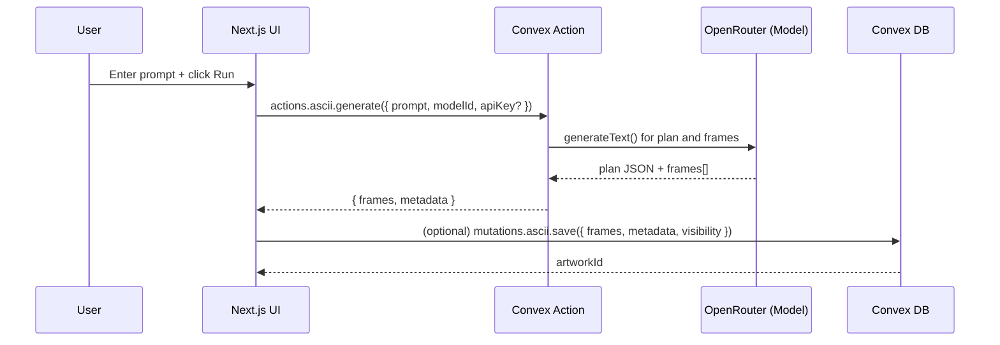
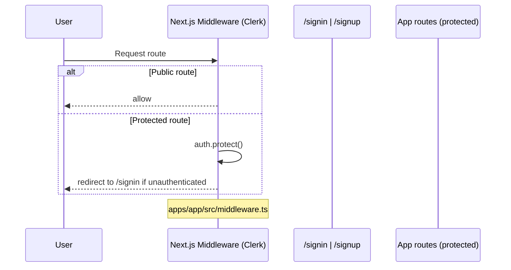
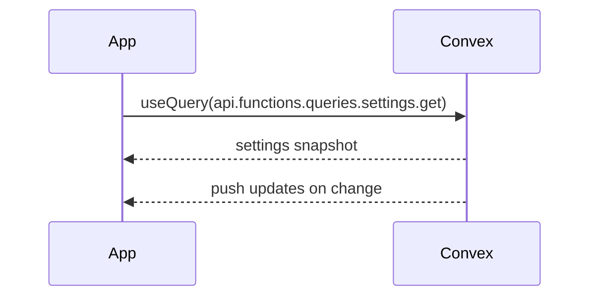

# ASCII XYZ – Architecture and Technical Documentation

This document maps the full system architecture for the ascii-xyz Turborepo and links to deep‑dive documentation in the `docs/` directory.

The platform is a Next.js 15 app that generates and shares ASCII animations with an AI backend powered by Convex and Clerk authentication. UI is composed with a lightweight design system modeled after Linear.

## Table of contents

1. Monorepo overview
2. High‑level architecture (Mermaid)
3. Data flows (UI → Convex → storage; auth; real‑time)
4. Component and module relationships
5. API and backend service map (Convex)
6. State management patterns (Jotai + Convex React)
7. Environment variables and configuration
8. Database/schema summary (Convex)
9. ASCII art generation pipeline and data formats
10. Bring Your Own Key (BYOK) AI support
11. Linear‑inspired design system usage
12. App routes inventory (apps/app/src/app)
13. Navigation to additional docs

---

## 1) Monorepo overview

- apps/app (package: `ascii-app`)
  - Next.js 15 app (React 19, Tailwind v4). Pages live under `apps/app/src/app` with route groups for authenticated/unauthenticated layouts.
  - Consumes Clerk for auth, Convex for data/real‑time, PostHog for analytics.
- packages/backend (`@repo/backend`)
  - Convex project (`packages/backend/convex`): schema, queries, mutations, actions, http router (Clerk webhook).
- packages/auth (`@repo/auth`)
  - Thin wrappers around Clerk (client, server, provider) and an optional billing façade.
- packages/design (`@repo/design`)
  - UI component library (shadcn/ui base + Linear‑inspired motion). Also ships design utilities, providers, and styles.
- packages/ascii (`@repo/ascii`)
  - Reusable ASCII engine, generators, hooks, and presets. The app also has an embedded copy at `apps/app/src/lib/ascii` for direct usage.

Build tooling: TypeScript 5.9, Turborepo, Biome/Ultracite for lint/format, Vitest in select packages.

---

## 2) High‑level architecture

```mermaid
flowchart LR
  subgraph Client[Browser]
    UI[Next.js 15 App\nReact 19 + Tailwind v4]\n
    Design[@repo/design\ncomponents + styles]
    AsciiUI[@repo/ascii\nengine/hooks/presets]
  end

  subgraph Edge
    Next[Next.js Routing\napp router + middleware]
  end

  subgraph Services
    Convex[(Convex Backend)]
    Clerk[(Clerk Auth)]
    PostHog[(PostHog Analytics)]
    OpenRouter[(OpenRouter AI Models)]
  end

  UI --> Next
  Next -- useQuery/useMutation, actions --> Convex
  Next -- ClerkProvider --> Clerk
  Next -- rewrites /ingest* --> PostHog
  Convex -- actions.ascii.generate --> OpenRouter
  Convex -- http /clerk-users-webhook --> Clerk
  Convex <---> ConvexDB[(Convex Storage)]
  Convex -. subscriptions .- Next
```

Key points
- All server state is handled by Convex. The app subscribes to live queries via `convex/react` hooks for real‑time updates.
- Auth is fully handled by Clerk (middleware protects non‑public routes; webhooks sync users into Convex tables).
- AI ASCII generation uses Convex actions that call OpenRouter models; BYOK allows users to supply their own API key.

---

## 3) Data flows

### 3.1 ASCII generation (client → Convex action → AI → Convex mutation)



Notes
- The UI calls the Convex action via `convex/nextjs` `fetchAction`. The action can accept a user‑provided API key (BYOK) or use `OPENROUTER_API_KEY`.
- Frame format is a JSON array of strings (each string is a multi‑line frame). See section 9.

### 3.2 Auth sign‑in / gate



### 3.3 Real‑time reads

Convex queries return live values; clients subscribe and re‑render on change.



---

## 4) Component and module relationships

System‑level relationships and boundaries:

```mermaid
graph TD
  A[apps/app UI] -->|consumes| D[@repo/design components]
  A -->|uses| J[Jotai atoms (ui + models)]
  A -->|convex/react| Q[Convex queries/mutations]
  A -->|uses| AE[@repo/ascii engine/hooks]
  A -->|uses local| ALE[apps/app/src/lib/ascii/*]
  Q --> S[(Convex schema tables)]
  A -->|auth context| CL[Clerk Provider]
```

Highlights
- Design components are strictly presentational; business logic stays in app hooks and Convex functions.
- Jotai atoms model UI and model selection state. Convex handles server state with live queries.
- The app currently uses a local copy of the ASCII engine under `apps/app/src/lib/ascii` and can also consume `@repo/ascii` where desired.

---

## 5) API and backend service map (Convex)

All Convex code lives under `packages/backend/convex`.

- Schema: `schema.ts`
- Auth helpers: `lib/auth.ts`
- ASCII helpers: `lib/ascii.ts`
- AI model selection: `lib/ai.ts`
- HTTP router (Clerk webhooks): `http.ts` (route `/clerk-users-webhook`)

Functions grouped by domain

- functions/actions/ascii.ts
  - generate(args: { prompt, apiKey?, userId?, modelId? }) → { frames: string[]; metadata: {...} }
  - generateVariation(args: { originalFrames, variationPrompt, apiKey?, userId?, modelId? }) → { frames, metadata }
  - enhance(args: { frames, enhancementType, apiKey? }) → { frames, enhancementType }
- functions/mutations/ascii.ts
  - save({ userId, prompt, frames, metadata, visibility? }) → artworkId
  - updateVisibility({ id, visibility }) → { success: true }
  - remove({ id, userId }) → { success: true }
  - incrementViews({ id }) → void
  - toggleLike({ id, userId, liked }) → void
- functions/queries/ascii.ts
  - list({ userId?, visibility?, limit? }) → Doc<'artworks'>[]
  - get({ id, userId? }) → Doc<'artworks'> | null (permission‑checked)
  - getPublic({ limit?, cursor? }) → Doc<'artworks'>[]
  - search({ query, userId?, limit? }) → Doc<'artworks'>[]
  - getTrending({ limit?, timeframe? }) → Doc<'artworks'>[]
- functions/queries/collections.ts (contains both queries and mutations)
  - list(), get({ id })
  - create({ name, description?, visibility? }) → id
  - addArtwork({ collectionId, artworkId }), removeArtwork({ ... })
  - update({ id, name?, description?, visibility? }), remove({ id })
- functions/queries/files.ts
  - getUrl({ storageId }), getFile({ fileId }), listUserFiles({ artworkId? })
- functions/queries/shares.ts (mix of queries + mutations)
  - create({ artworkId, expiresIn?, maxViews? }) → { shareId, shareCode }
  - getByCode({ shareCode }) → artwork | null
  - list() → share[] (for current user)
  - revoke({ shareId })

---

## 6) State management patterns

- Client state: Jotai atoms for UI state, model selection, preferences.
- Server state: Convex live queries/mutations via `convex/react`.
- No SWR for server state — Convex provides real‑time subscriptions.

---

## 7) Environment variables and configuration

See `../ENVIRONMENT.md` for full details, including Clerk/Convex/OpenRouter/PostHog configuration and where each value is consumed in the codebase.

---

## 8) Database/schema summary (Convex)

Schema overview, tables, and relationships are documented in `../api/schema.md`.

---

## 9) ASCII art generation pipeline and data formats

- Frames are stored/transferred as a JSON array of strings. Each string is a multi‑line ASCII frame.
- The engine (`@repo/ascii`) can render frames at 12–24 fps with visibility-optimized updates.
- Keep frames small for mobile; prefer caching static frames and pausing when off‑screen.

---

## 10) Bring Your Own Key (BYOK) AI support

- Users can supply an OpenRouter API key for generation/enhancement.
- The app prefers the user key when provided and falls back to `OPENROUTER_API_KEY`.

---

## 11) Linear‑inspired design system usage

- Design components are sourced from `@repo/design` with motion utilities.
- Motion policy (Linear‑style): 0ms in / 150ms out for general UI; 0/0 for menu‑like portals. See `packages/design/styles/transitions.css` and `../linear-ux.md`.

---

## 12) App routes inventory (apps/app/src/app)

This inventory reflects the latest default‑branch structure. Key routes:

- `/` — Create (home)
- `/gallery` — Gallery list
- `/art/[id]` — Artwork detail (under `(authenticated)/(main)/art/[id]`)
- `/share/[token]` — Public share view

If new pages are added under `apps/app/src/app`, update this section and the `../user-flows/*` diagrams accordingly.

---

## 13) Navigation to additional docs

- User flows (Mermaid): `../user-flows/`
- Component library docs: `../components/`
- API/backend docs: `../api/`
- Onboarding and environment setup: `../ONBOARDING.md`, `../ENVIRONMENT.md`
