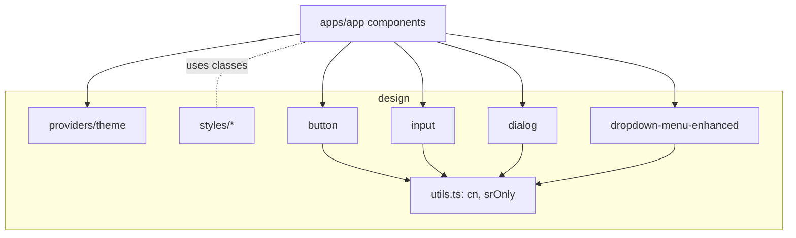

# @repo/design – Component Library Documentation

This package provides a set of accessible, composable UI primitives (based on shadcn/ui + Radix) with a Linear‑inspired motion policy. Components are exported via `@repo/design/components` and `@repo/design/components/ui/*`.

## Inventory (exports)

Exports from `packages/design/components/ui` as of 2025‑09‑05:

- accordion
- alert
- alert-dialog
- aspect-ratio
- avatar
- badge
- breadcrumb
- button
- calendar
- card
- carousel
- chart
- checkbox
- collapsible
- command
- context-menu
- dialog
- drawer
- dropdown-menu
- dropdown-menu-enhanced
- form
- hover-card
- input
- input-otp
- label
- menubar
- navigation-menu
- pagination
- popover
- progress
- radio-group
- resizable
- scroll-area
- select
- separator
- sheet
- skeleton
- slider
- sonner
- switch
- table
- tabs
- textarea
- toast
- toggle
- toggle-group
- tooltip
- use-toast

Utilities and providers
- `@repo/design/lib/utils` → `cn`, `capitalize`, `handleError`, `srOnly`
- `@repo/design/providers/theme` → `ThemeProvider`
- Styles → `packages/design/styles/*` (not auto‑injected; imported by app)

## Motion and interaction policy

- General UI: 0ms in / 150ms out (linear timing). Menus/sheets/modals rendered in portals: 0ms / 0ms.
- Use provided utility classes: `hover-transition`, `hover-bg`, `menu-item`, etc. See `packages/design/styles/transitions.css` and `docs/linear-ux.md`.

## Component details and props

Below are representative components with purpose, props, defaults, and examples. Most components follow shadcn/ui patterns: props extend Radix primitives or native element props, plus styling via Tailwind and `cn()`.

### Button

Source: `packages/design/components/ui/button.tsx`

Purpose
- Generic action button with variants and sizes; integrates class-variance-authority for deterministic styling.

Props (TypeScript)
```ts
type ButtonProps = React.ComponentProps<'button'> &
  VariantProps<typeof buttonVariants> & { asChild?: boolean };

// Variants: default | accent | destructive | outline | secondary | ghost | link | subtle | paper | fm | phono | power | mono | control
// Sizes: default | sm | lg | icon | pill | square
```

Defaults
- `variant: 'default'`, `size: 'default'`, `asChild: false`.

Example
```tsx
import { Button } from '@repo/design/components/ui/button';

<Button onClick={onClick}>Save</Button>
<Button variant="outline" size="sm">Cancel</Button>
<Button variant="destructive">Delete</Button>
```

### Input

Source: `packages/design/components/ui/input.tsx`

Purpose
- Styled text input; merges classes with `cn()` and sets focus/invalid states.

Props
- Extends `React.ComponentProps<'input'>`.

Example
```tsx
import { Input } from '@repo/design/components/ui/input';

<Input placeholder="Search" aria-label="search" />
```

### Dialog

Source: `packages/design/components/ui/dialog.tsx`

Purpose
- Modal dialog built on Radix Dialog with consistent surfaces and no entrance delay (0/0ms).

Props
- Exposes shadcn/ui’s `Dialog`, `DialogTrigger`, `DialogContent`, etc. Props mirror Radix.

Example
```tsx
import { Dialog, DialogContent, DialogHeader, DialogTitle } from '@repo/design/components/ui/dialog';

<Dialog>
  <DialogContent>
    <DialogHeader>
      <DialogTitle>Title</DialogTitle>
    </DialogHeader>
    Body
  </DialogContent>
  {/* … */}
</Dialog>
```

### Dropdown Menu (Enhanced)

Source: `packages/design/components/ui/dropdown-menu-enhanced.tsx`

Purpose
- A dropdown menu wrapper with persistent hover index and instant menu interactions matching Linear’s feel.

Key props
- Inherits from `@radix-ui/react-dropdown-menu` components; additional `defaultHoverIndex?: number | null` on the root.

Example
```tsx
import {
  DropdownMenu,
  DropdownMenuTrigger,
  DropdownMenuContent,
  DropdownMenuItem,
} from '@repo/design/components/ui/dropdown-menu-enhanced';

<DropdownMenu defaultHoverIndex={0}>
  <DropdownMenuTrigger>Open</DropdownMenuTrigger>
  <DropdownMenuContent>
    <DropdownMenuItem index={0}>New</DropdownMenuItem>
    <DropdownMenuItem index={1}>Open</DropdownMenuItem>
  </DropdownMenuContent>
</DropdownMenu>
```

### Card

Purpose
- Surface with `Card`, `CardHeader`, `CardContent`, etc.; props mirror native/ Radix equivalents.

Example
```tsx
import { Card, CardHeader, CardTitle, CardContent } from '@repo/design/components/ui/card';

<Card>
  <CardHeader>
    <CardTitle>Settings</CardTitle>
  </CardHeader>
  <CardContent>…</CardContent>
</Card>
```

### Toasts

Source: `packages/design/components/ui/sonner.tsx` and `use-toast.ts`.

Purpose
- Thin wrappers around Sonner; use `toast` helpers from app code as needed.

---

## Dependency and composition graph



Notes
- Components depend on `cn()` for deterministic class merging.
- Motion policy classes from `styles/transitions.css` are used across UI.

## Usage guidelines

- Keep components presentational; move data fetching and business logic to app hooks/services.
- Compose primitives rather than expanding single components with too many props.
- Respect accessibility: ARIA attributes, keyboard navigation, focus management.
