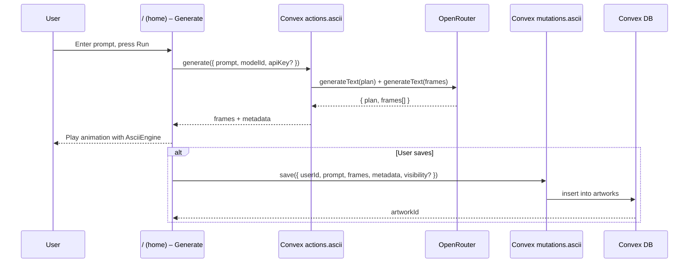

# User Flow – ASCII Creation

From prompt entry to animated ASCII playback and optional persistence.

Notes
- The UI’s engine (`AsciiEngine`) renders frames client‑side with low overhead.
- BYOK: if the user supplied an OpenRouter key, it’s forwarded to the action; otherwise the server’s `OPENROUTER_API_KEY` is used.

Key files
- Page and actions: `apps/app/src/app/(authenticated)/page.tsx`, `apps/app/src/app/(authenticated)/create/actions.ts`
- Backend actions: `packages/backend/convex/functions/actions/ascii.ts`
- Backend mutations: `packages/backend/convex/functions/mutations/ascii.ts`
