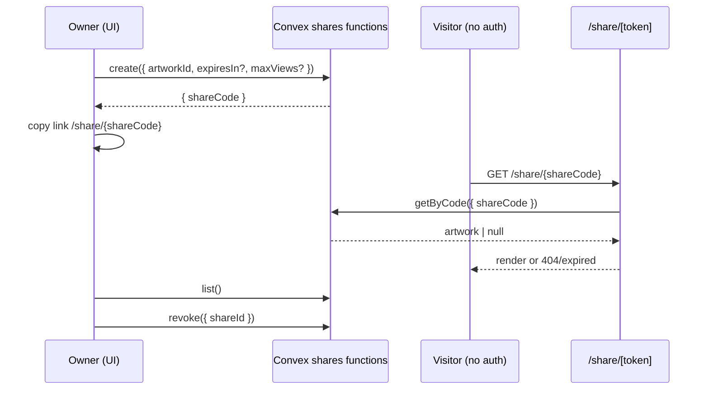

# User Flow – Sharing and collaboration

Time‑boxed links allow viewing without an account. Owners can list and revoke shares.

Notes
- View counts can be enforced via mutations when needed (`viewCount` field exists on shares).
- Expiration is evaluated in `getByCode` before returning the artwork.
