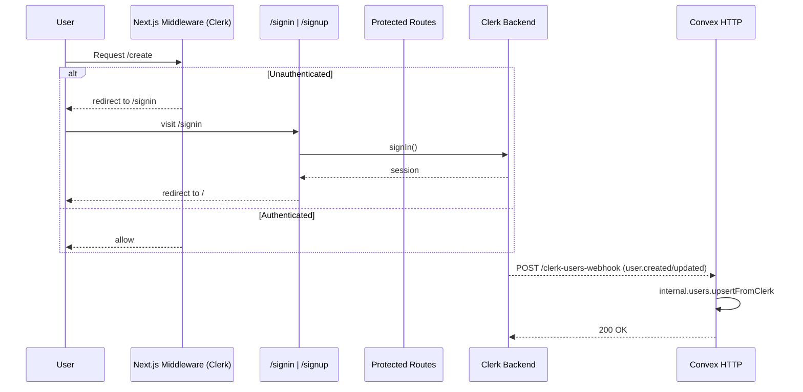

# User Flow – Sign up / Sign in

This flow shows how users authenticate with Clerk, how the app gates protected routes, and how users are synced into Convex.

Key files
- App middleware: `apps/app/src/middleware.ts`
- Clerk provider: `packages/auth/provider.tsx`
- Clerk webhook router: `packages/backend/convex/http.ts`

Public vs protected
- Public: `/`, `/signin`, `/signup`, `/share/*`, static assets.
- Protected: everything else; middleware runs `auth.protect()` for non‑public routes.
